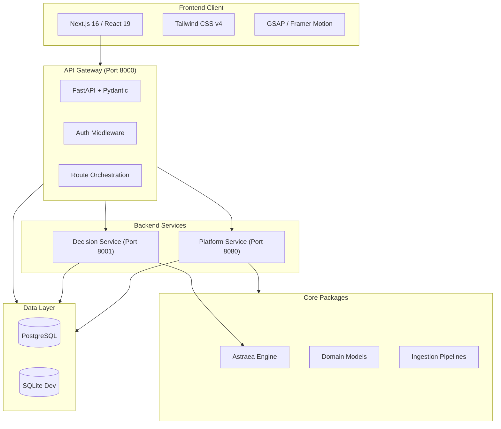
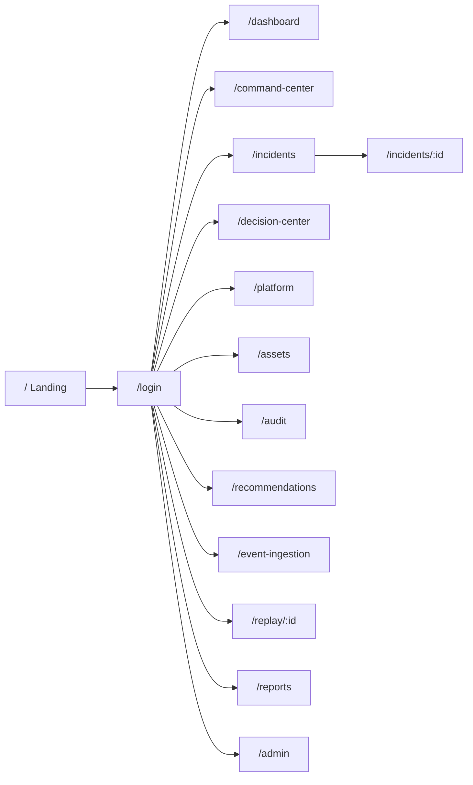

# Aether Sentinel

[](https://github.com/AngelP17/aether-sentinel/actions)

**Operational intelligence platform for explainable incident decisions, human-in-the-loop workflows, and replayable audit trails.**

Aether Sentinel turns noisy operational signals into deterministic, explainable, and replayable action. It is not a dashboard. It is a closed-loop decision system for manufacturing and infrastructure operations.

---

## 60-Second System Tour

1. **Signal arrives** from machine telemetry, ticketing, Kubernetes alerts, or operator notes.
2. **Event is normalized** into a canonical operational event with schema validation.
3. **Astraea scores** severity, urgency, business impact, SLA risk, recurrence, dependency criticality, actionability, and uncertainty.
4. **Aether correlates** the event into an incident and routes the workflow.
5. **A human operator** accepts, rejects, or overrides the recommendation.
6. **The system preserves** replay hashes, explanations, feedback, and platform evidence for audit.

---

## Why This Is Not a Dashboard

A dashboard displays state.
Aether Sentinel changes the operational decision loop.

The system is built around **decision accountability**:
- What happened
- Why it mattered
- What was recommended
- Who acted
- How the decision can be replayed

Most systems show you that CPU is high.
Aether Sentinel tells you that this CPU spike correlates with a ticket from three days ago, affects a business-critical workflow, and should be routed to the on-call engineer who resolved the last similar incident.

---

## Flagship Demo Path

```bash
# 1. Install everything
make install

# 2. Start the full stack
make demo

# 3. Seed a known scenario
make demo-seed

# 4. Validate the end-to-end path
make demo-validate
```

This creates a real, deterministic incident from raw signal to audit export that you can inspect in the web UI at `http://localhost:3000`.

---

## Architecture

### System Flow

```mermaid
flowchart LR
    subgraph Sources["Operational Signal Sources"]
        Tickets["Tickets / Operator Notes"]
        MachineEvents["Machine Telemetry"]
        K8sAlerts["Kubernetes Alerts"]
        Prometheus["Prometheus Metrics"]
    end

    subgraph Ingestion["Ingestion & Normalization"]
        Ingest["Ingest Event"]
        Normalize["Normalize Payload"]
        Validate["Validate Schema"]
        StoreEvent["Store Operational Event"]
    end

    subgraph Decision["Astraea Decision Engine"]
        Features["Extract Features"]
        Score["Score Priority & Risk"]
        Explain["Generate Explanation"]
        Hash["Create Replay Hash"]
    end

    subgraph Workflow["Aether Workflow Layer"]
        Correlate["Correlate Incident"]
        Route["Route Ownership"]
        Recommend["Generate Recommendations"]
        Feedback["Capture Human Feedback"]
    end

    subgraph Evidence["Platform Evidence Layer"]
        SLO["SLO Metrics"]
        Runbook["Runbook Mapping"]
        Topology["Topology Graph"]
        Chaos["Chaos Results"]
    end

    subgraph Audit["Replay & Audit"]
        Timeline["Replay Timeline"]
        Verify["Verify Hash"]
        Export["Audit Export"]
        Report["Post-Incident Report"]
    end

    Sources --> Ingest
    Ingest --> Normalize
    Normalize --> Validate
    Validate --> StoreEvent
    StoreEvent --> Features
    Features --> Score
    Score --> Explain
    Explain --> Hash
    Hash --> Correlate
    Correlate --> Route
    Route --> Recommend
    Recommend --> Feedback
    Feedback --> StoreEvent
    Evidence --> StoreEvent
    StoreEvent --> Timeline
    Timeline --> Verify
    Verify --> Export
    Export --> Report
```



### Service Architecture



### Frontend Route Map



| Service | Responsibility | Tech |
|---------|---------------|------|
| `web` | Landing, command center, dashboard, incidents, decisions, platform, assets, audit, recommendations, event ingestion, replay UI | Next.js 16, React 19, Tailwind v4, GSAP |
| `api-gateway` | Public API boundary, auth, orchestration | FastAPI |
| `decision-service` | Deterministic scoring, explainability, replay | Python (Astraea) |
| `platform-service` | SLOs, runbooks, topology, controls, chaos | FastAPI |

---

## Core Design Decisions

| Decision | Rationale |
|----------|-----------|
| **Deterministic scoring** | Same input always produces same output. Auditors can verify. Post-mortems can reconstruct exact reasoning. |
| **Human-in-the-loop** | System recommends. Humans decide. No unilateral automation. Feedback improves future recommendations. |
| **Replay hashes** | SHA-256 of inputs guarantees decision integrity. Any tampering changes the hash. |
| **SLO-backed evidence** | Infrastructure incidents are judged by user-facing impact, not just symptoms. |
| **Immutable records** | Raw events are never modified. Decision records are append-only. Evidence is checksummed. |

---

## Frontend Surface

| Route | Purpose | Data Source |
|-------|---------|-------------|
| `/` | Cinematic landing page with live metrics | `/api/metrics`, `/api/incidents`, `/api/tickets` |
| `/dashboard` | System health bento overview | `/api/metrics`, `/api/tickets` |
| `/command-center` | Primary operator work queue | `/api/tickets`, `/api/decisions` |
| `/incidents` | Incident browser with search and filter | `/api/incidents` |
| `/incidents/[id]` | Incident detail with timeline and resolve | `/api/incidents/{id}`, `/api/incidents/{id}/timeline` |
| `/decision-center` | Astraea decisioning and human overrides | `/api/decisions`, `/api/recommendations` |
| `/platform` | SRE control plane — SLOs, topology, chaos | `/api/platform/summary`, `/api/platform/topology`, `/api/platform/controls` |
| `/assets` | Infrastructure asset inventory | `/api/assets` |
| `/audit` | Audit trail viewer and export | `/api/audit/events` |
| `/recommendations` | Recommendation workflow management | `/api/recommendations` |
| `/event-ingestion` | Event ingestion interface | `/api/events/ingest` |
| `/replay/[id]` | Point-in-time replay and audit | `/api/replay/incidents/{id}` |
| `/reports` | Executive and operational reporting | `/api/metrics` |

All operational pages use real API data with automatic fallback to demo scenarios when live services are unavailable. Every page includes loading, error, and empty states.

---

## Screenshots

### Landing Page


### Login


### Dashboard


### Command Center


### Incidents


### Incident Detail


### Decision Center


### Platform


### Assets


### Audit


### Recommendations


### Event Ingestion


### Replay


### Reports


### Admin


---

## Quick Start

### Prerequisites

- Python 3.11+
- Node.js 22+
- pnpm
- PostgreSQL 15+ (or SQLite for local dev)

### Install

```bash
make install
```

### Run tests

```bash
make test
```

### Run the full stack

```bash
make demo
```

Then open `http://localhost:3000` for the command center.

**Demo login credentials:**
| Username | Password | Role |
|----------|----------|------|
| `admin` | `admin` | Administrator |
| `operator` | `operator` | Agent (recommended for demo) |
| `viewer` | `viewer` | Read-only |

### Manual service start

```bash
# API Gateway
uvicorn apps.api_gateway.main:app --reload --port 8000

# Platform Service
uvicorn services.platform-service.src.main:app --reload --port 8080

# Decision Service
uvicorn services.decision-service.main:app --reload --port 8001

# Web App
cd apps/web && pnpm dev
```

---

## Repo Structure

```text
aether-sentinel/
├── apps/
│   ├── api_gateway/       # FastAPI gateway
│   └── web/               # Next.js command center
├── services/
│   ├── decision-service/  # Astraea wrapper
│   └── platform-service/  # K8s platform API
├── packages/
│   ├── astraea-core/      # Deterministic engine
│   ├── domain/            # Domain models
│   └── pipelines/         # Ingestion pipelines
├── infrastructure/
│   ├── db/                # SQLAlchemy models, migrations
│   ├── k8s/               # Kubernetes manifests
│   ├── terraform/         # Infrastructure as code
│   └── monitoring/        # Prometheus, Grafana
├── scripts/
│   └── demo/              # Seeding and validation scripts
├── sample-data/           # Deterministic demo scenarios
├── tests/                 # Unit, integration, e2e tests
├── docs/                  # Architecture, theory, ADRs, diagrams
└── .github/               # CI workflows, issue templates
```

---

## Quality Gates

| Gate | Command | Status |
|------|---------|--------|
| Python tests | `make test` | 13 passed |
| TypeScript check | `pnpm --dir apps/web typecheck` | Pass |
| Next.js build | `pnpm --dir apps/web build` | Pass |
| Audit | `pnpm --dir apps/web audit --prod` | 0 vulnerabilities |
| Lint | `make lint` | Pass |
| Demo validation | `make demo-validate` | End-to-end verified |

---

## License

MIT
