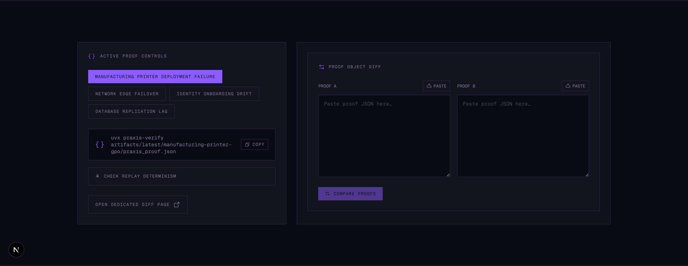
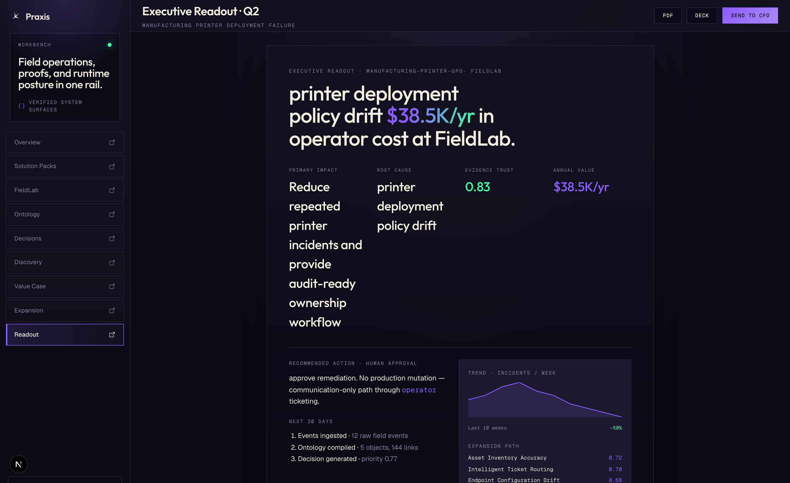
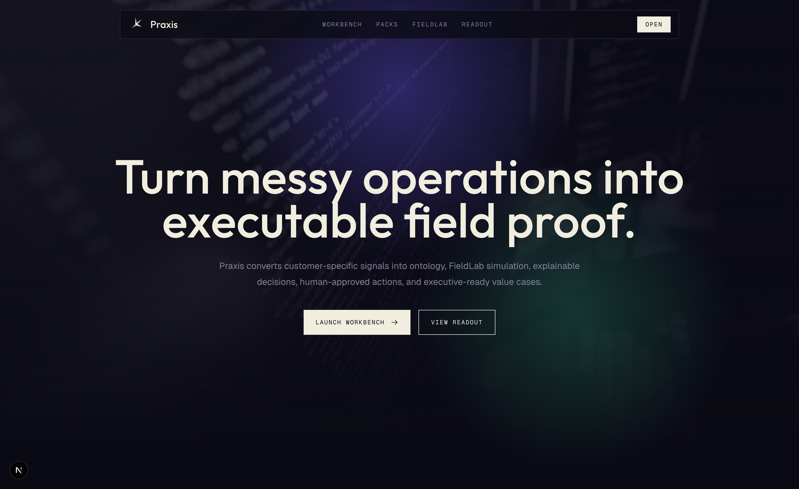
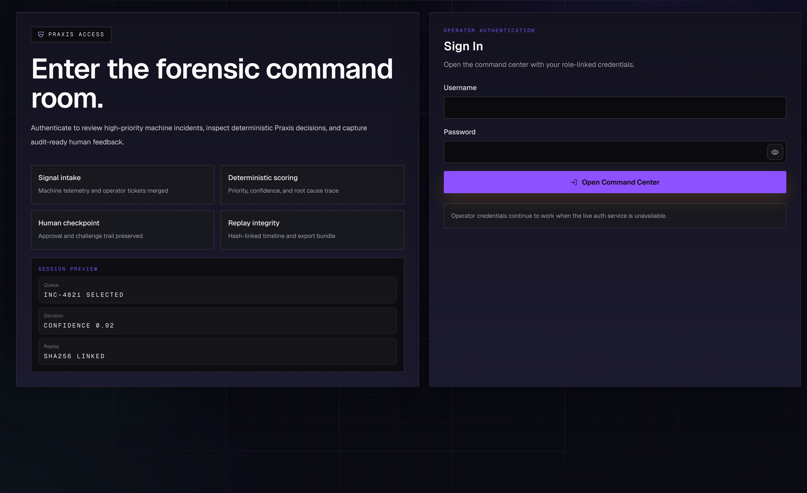

# Praxis

[](https://github.com/AngelP17/praxis/actions)
[](https://github.com/AngelP17/praxis/actions/workflows/fieldlab-proof.yml)
[](DETERMINISM.md)
[](docs/spec/praxis-proof-protocol.md)

**Proof-carrying field deployment for enterprise operations.**

Praxis is the reference implementation of the **Praxis Proof Protocol** — the first open spec for cryptographically verifiable AI decision provenance. It turns customer-specific operational signals into executable decision graphs, local proof-of-value environments, audit-ready workflows, and measurable implementation plans.

> **Verify any Praxis proof in one command:**
> ```bash
> uvx praxis-verify ./praxis_proof.json
> ```

### Key Artifacts

| Artifact | Description |
|----------|-------------|
| [PPP Spec v0.1](docs/spec/praxis-proof-protocol.md) | Formal protocol for AI decision provenance |
| [Proof Schema](docs/spec/proof-object.schema.json) | JSON Schema for conformant proof objects |
| [Whitepaper](docs/whitepaper/praxis-proof-protocol.md) | 10-page technical whitepaper |
| [DETERMINISM.md](DETERMINISM.md) | Bit-deterministic proof guarantees |
| [Hiring Pages](docs/for-hiring-managers/) | Role-targeted competency mappings |
| `uvx praxis-verify` | Third-party CLI verifier on PyPI |

## Verified Runtime

The full Floci-backed FieldLab path is verified on every push via `.github/workflows/fieldlab-proof.yml`:

```
Floci start -> health check -> demo run -> proof emit -> verify -> determinism re-run -> sigstore sign
```

[View latest CI run](https://github.com/AngelP17/praxis/actions/workflows/fieldlab-proof.yml)

The web app also ships a Next.js `app/api` bridge for frontend stability. In local development it proxies the web UI to the FastAPI gateway; on Vercel it serves deterministic demo payloads for proofs, solution packs, Floci health, replay checks, and pipeline streaming so the flagship surfaces do not 404 when the backend is not deployed beside the frontend.

## Release Modes

Praxis currently has two honest release modes:

- **Frontend-only public demo**: ready now. Deploy the Next.js app with `NEXT_PUBLIC_DEMO_MODE=1` and the flagship surfaces run on deterministic demo fallbacks.
- **Full-stack public production**: not turnkey yet. The repo includes the backend services and reference infrastructure, but you still need real secrets, explicit public CORS origins, rotated demo credentials, and a chosen backend hosting target.

Before a real public production launch:

- Replace `SECRET_KEY` with a strong runtime secret
- Set `ALLOWED_ORIGINS` to the real public frontend domains
- Replace or rotate demo credentials in `users.json`
- Validate the chosen backend hosting path

See [docs/release/public-launch-checklist.md](docs/release/public-launch-checklist.md) and [docs/architecture/deployment-guide.md](docs/architecture/deployment-guide.md).

## Prove Praxis Works

Praxis is verified through a local FieldLab run, not a pre-recorded video. The flagship proof path loads the manufacturing solution pack, streams messy events through the Floci-backed FieldLab, compiles an operational ontology, generates a proof-carrying decision, captures a human-approved action, and produces an executive value case.

```bash
make install
make praxis-fieldlab-up
make praxis-proof
make praxis-benchmark
make praxis-floci-verify
make praxis-fieldlab-down
```

The proof path emits `artifacts/latest/praxis_proof.json` and `artifacts/latest/proof-summary.md`.

> **Tag:** `praxis-v1` — Field-Deployed Decision Platform

## Operational-Resilience Spine

Praxis now also supports a concrete event-driven resilience slice on the existing API path:

```bash
make praxis-seed-graph
make dev-api
make praxis-printer-slice
```

That path emits a `printer.offline` CloudEvent, stores it in `operational_events`, resolves the asset dependency graph, computes a deterministic Astraea decision, writes `decision_records`, records human feedback through the existing approval endpoints, persists a durable outbox row, and replays the decision by recomputing the canonical hash.

See [docs/praxis/printer-offline-slice.md](docs/praxis/printer-offline-slice.md) for the exact commands and proof steps.

## Deterministic Scenario Benchmarks

Every registered scenario produces a stable replay hash. Run `make praxis-scenario-benchmark` to regenerate.
The frontend fallback artifact at `apps/web/src/lib/generated/scenarios.generated.json` is generated from the Python registry with `make praxis-sync-frontend-scenarios`.

| Scenario | Event Type | Risk | Deterministic | Est. Annual Value |
|----------|-----------|------|:---:|-------:|
| Printer GPO Offline | com.praxis.asset.printer.offline | high | True | $38,400 |
| HVAC Temp Drift | com.praxis.asset.hvac.temp_drift | critical | True | $62,000 |
| MQTT Broker Lag | com.praxis.infra.mqtt.queue_depth_spike | high | True | $29,500 |
| AD Policy Drift | com.praxis.identity.ad.gpo_drift | critical | True | $110,000 |
| EHS Safety Breach | com.praxis.safety.ehs.voc_threshold_breach | critical | True | $250,000 |
| SAP Batch Stall | com.praxis.erp.sap.batch_stall | high | True | $47,000 |
| WMS Pick Timeout | com.praxis.warehouse.wms.pick_timeout_cascade | medium | True | $31,000 |
| RFID Reader Dropout | com.praxis.iot.rfid.reader_dropout | medium | True | $18,500 |

Run a single scenario with `make praxis-run-scenario SCENARIO=printer-offline` or all with `make praxis-run-all-scenarios`.

---

## Screenshots

| Landing | Field Workbench | Proof Object |
|---------|----------------|--------------|
|  |  |  |

| Executive Readout | Solution Packs | Command Center |
|-------------------|----------------|----------------|
|  |  |  |

---

## Why Praxis Exists

Enterprises do not fail because they lack dashboards.

They fail because operational knowledge, data, decisions, ownership, and actions are fragmented across tickets, spreadsheets, ERP systems, machine telemetry, tribal knowledge, and vendors.

Praxis turns that fragmentation into a deployable decision graph:

```
Customer data -> Operational ontology -> Decision engine -> Human action -> Audit trail -> Value proof -> Expansion roadmap
```

Dashboards show state. **Praxis drives operational decisions.**

---

## What Praxis Does

1. Ingest messy customer signals (tickets, telemetry, alerts, operator notes)
2. Compile an operational ontology (objects, links, actions, metrics)
3. Simulate the customer workflow locally through **Praxis FieldLab** (Floci-backed AWS emulation)
4. Generate explainable decisions and human-approved actions
5. Produce replayable audit artifacts with cryptographic integrity
6. Build a value case, deployment plan, and executive readout

---

## Target Roles Demonstrated

| Target role | Praxis proof |
|-------------|-------------|
| **Solutions Engineer** | Can scope a customer use case, build a technical demo, explain architecture, handle security/compliance, and show business value |
| **GTM Engineer** | Can package repeatable demo systems, solution templates, ROI calculators, customer narratives, and product feedback loops |
| **Forward Deployed Engineer** | Can integrate messy customer data, model operational workflows, build adapters, deploy locally, and iterate with users |
| **Platform Engineer** | Integrates Floci-backed local AWS services to simulate production event pipelines without cloud credentials |

---

## Flagship Demo: Printer GPO Failure to Executive Value Case

```bash
# 1. Install everything
make install

# 2. Start the full stack for the UI/API demo
make demo

# 3. Seed a known scenario
make demo-seed

# 4. Validate the end-to-end path
make demo-validate

# Or run the proof-first artifact path
make praxis-fieldlab-up
make praxis-proof
make praxis-fieldlab-down
```

A plant reports repeated printer failures affecting shipping paperwork. Praxis ingests the signal, maps it to the operational ontology, identifies the affected business process, scores the evidence, routes a human-approved action, generates an audit trail, and builds a value case for standardizing printer deployment governance.

This creates a real, deterministic incident from raw signal to audit export that you can inspect in the web UI at `http://localhost:3000`.

The proof path emits `artifacts/latest/praxis_proof.json` and verifies it with deterministic hash integrity.

---

## Architecture

```
Praxis
├── FieldLab (Floci local AWS substrate)
│   ├── SQS event queues
│   ├── S3 audit and evidence archive
│   ├── DynamoDB operational state
│   ├── EventBridge workflow events
│   └── Lambda-style customer adapters
│
├── Ontology Compiler
│   ├── Customer objects, Assets, Events, Incidents
│   ├── Actions, Stakeholders, Value metrics
│   └── Links, confidence scoring
│
├── Decision Engine
│   ├── Priority scoring (weighted multi-factor)
│   ├── Evidence trust scoring
│   ├── Causal graph reasoning
│   ├── Value-of-information ranking
│   ├── Counterfactual replay
│   └── Human review thresholds
│
├── GTM Engine
│   ├── Solution packs (repeatable demos)
│   ├── ROI model
│   ├── Objection handling
│   ├── Security/compliance answers
│   └── Expansion map
│
└── Field Workbench
    ├── Customer discovery
    ├── Data mapping
    ├── Demo execution
    ├── Implementation plan
    ├── Audit export
    └── Executive readout
```

### Service Architecture

| Service | Responsibility | Tech |
|---------|---------------|------|
| `web` | Landing, command center, dashboard, field workbench, solution packs, ontology, value case, executive readout | Next.js 16, React 19, Tailwind v4, GSAP |
| `api-gateway` | Public API boundary, auth, orchestration, decision explanation, fieldlab, solution packs, ontology | FastAPI |
| `decision-service` | Deterministic scoring, explainability, replay | Python (Praxis core) |
| `platform-service` | SLOs, runbooks, topology, controls, chaos | FastAPI |

---

## Core Design Decisions

| Decision | Rationale |
|----------|-----------|
| **Deterministic scoring** | Same input always produces same output. Auditors can verify. Post-mortems can reconstruct exact reasoning. |
| **Human-in-the-loop** | System recommends. Humans decide. No unilateral automation. Feedback improves future recommendations. |
| **Replay hashes** | SHA-256 of inputs guarantees decision integrity. Any tampering changes the hash. |
| **Provenance-weighted evidence** | Priority and confidence depend on evidence freshness, source reliability, corroboration, and audit completeness. |
| **Counterfactual testing** | Score stability is verified under evidence removal or perturbation. Unstable decisions are flagged for review. |
| **FieldLab local simulation** | Reproduce customer workflows locally through Floci before touching production infrastructure. |
| **Solution packs** | Repeatable demo systems with scenarios, ROI models, objection handling, and security reviews. |

---

## Flagship Algorithms

### Operational Ontology Compiler
Turns messy customer inputs into a structured operational model (Objects + Links + Actions + Metrics + Risks). Maps raw data to object types (Site, Asset, Incident, Vendor, Stakeholder, BusinessProcess) with confidence scoring.

### Evidence Trust Score
Grades the quality of evidence behind recommendations using source reliability, freshness, corroboration, completeness, consistency, and auditability.

### Use Case Qualification Score
Scores whether a customer use case is worth pursuing (pain intensity, data readiness, stakeholder urgency, measurable value, deployability, expansion leverage).

### Value-of-Information Ranking
When data is missing, Praxis identifies which questions to ask first based on expected confidence gain, business impact, and acquisition feasibility.

### Intervention Planner
Turns recommendations into field-safe actions with modes: READ_ONLY, HUMAN_APPROVAL, ASSISTED_ACTION, WRITEBACK (simulated only), BLOCKED.

### Expansion Graph
Shows how a pilot expands into a bigger account, scoring adjacent use cases by shared data model, stakeholder overlap, measurable value, and implementation reuse.

---

## Praxis Field Workbench Flow

```
1. Select Solution Pack
2. Load Customer Context
3. Compile Operational Ontology
4. Start FieldLab (Floci)
5. Stream Events through SQS/S3/DynamoDB
6. Generate Decisions
7. Review Recommendations
8. Capture Human Action
9. Produce Replay Artifact
10. Generate Value Case
11. Generate Executive Readout
12. Generate Deployment Plan
```

---

## Frontend Surface

| Route | Purpose | Role signal |
|-------|---------|-------------|
| `/` | Landing page with live metrics | All |
| `/dashboard` | System health bento overview | Operator |
| `/command-center` | Primary operator work queue with decision explanations | Operator |
| `/console` | Live pipeline console with Floci health and verifier controls | Operator |
| `/incidents/[id]` | Incident detail with timeline | Operator |
| `/decision-center` | Decision center with counterfactual deltas | Operator |
| `/field-workbench` | End-to-end customer workflow from discovery to readout | FDSE |
| `/solution-packs` | Catalog of repeatable demo packs | GTM Engineer |
| `/fieldlab` | Floci-backed local environment status and event flow | Platform/SE |
| `/ontology` | Operational object graph, links, and actions | FDSE |
| `/value-case` | ROI calculator and assumptions | GTM Engineer |
| `/executive-readout` | CFO/COO-ready summary | GTM/SE |
| `/proof/[proofId]` | Cinematic proof detail, verifier flow, and diff workflow | Solutions Engineer |
| `/platform` | SRE control plane — SLOs, topology, chaos | Platform |
| `/assets` | Infrastructure asset inventory | Operator |
| `/audit` | Audit trail viewer and export | Operator |
| `/replay/[id]` | Point-in-time replay with forensics | Operator |
| `/reports` | Executive and operational reporting | Operator |
| `/admin` | Role-gated admin console | Admin |

---

## Quick Start

### Prerequisites

- Python 3.11+
- Node.js 22+
- pnpm
- PostgreSQL 15+ (or SQLite for local dev)
- Docker (for FieldLab/Floci)

### Install

```bash
make install
```

### Run tests

```bash
make test
```

### Run the full stack

```bash
make demo
```

Then open `http://localhost:3000` for the command center.

**Demo login credentials:**
| Username | Password | Role |
|----------|----------|------|
| `admin` | `admin` | Administrator |
| `operator` | `operator` | Agent (recommended for demo) |
| `viewer` | `viewer` | Read-only |

### FieldLab (requires Docker)

```bash
make praxis-fieldlab-up     # Start Floci local AWS emulation
make praxis-fieldlab-down   # Stop Floci
```

### Solution Packs

```bash
make praxis-demo            # Run the flagship demo
make praxis-validate-pack   # Validate a solution pack
make praxis-readout RUN_ID=xyz  # Generate executive readout
```

---

## Running Praxis

### Option 1 — Frontend demo only (no backend required)

The fastest path. All product surfaces work with deterministic demo data.

Deploy to [Vercel](https://vercel.com) with one environment variable:

```
NEXT_PUBLIC_DEMO_MODE=1
```

`vercel.json` at the repo root is already configured for a frontend-only Next.js deploy.

### Option 2 — Full stack locally

```bash
make install      # set up Python venv + Node deps
make demo         # start API gateway, decision service, platform service, and web on localhost
make demo-seed    # load the press-vibration-cascade demo scenario
```

Open `http://localhost:3000`. Login credentials: `operator` / `operator` (agent role).

### Option 3 — Self-hosted / cloud backend

The repo ships ready-to-use configs for three paths:

| Path | Config file | Best for |
|---|---|---|
| VPS / any Docker host | [`docker-compose.prod.yml`](docker-compose.prod.yml) | DigitalOcean, Hetzner, EC2 |
| Fly.io | [`fly.toml`](fly.toml) | Managed containers, global edge |
| Railway | [`railway.toml`](railway.toml) | Instant deploys, built-in Postgres |

Quick start for each path (Fly.io example):

```bash
fly apps create praxis-api
fly postgres create --name praxis-db && fly postgres attach --app praxis-api praxis-db
fly secrets set ENV=production DEBUG=false \
  SECRET_KEY="$(openssl rand -base64 32)" \
  ALLOWED_ORIGINS="https://your-frontend.vercel.app"
fly deploy
```

Then set `NEXT_PUBLIC_API_URL=https://praxis-api.fly.dev` in your frontend deployment and remove `NEXT_PUBLIC_DEMO_MODE`.

Full instructions for all three paths: [docs/architecture/deployment-guide.md](docs/architecture/deployment-guide.md)

---

## Repo Structure

```text
praxis/
├── apps/
│   ├── api_gateway/       # FastAPI gateway + fieldlab, ontology, solution packs
│   └── web/               # Next.js command center + field workbench
├── services/
│   ├── decision-service/  # Praxis decision wrapper
│   └── platform-service/  # K8s platform API
├── packages/
│   ├── astraea-core/      # Deterministic engine + praxis algorithms
│   ├── domain/            # Domain models
│   └── pipelines/         # Ingestion pipelines + fieldlab adapters
├── solution-packs/        # Repeatable demo systems
│   ├── manufacturing-printer-gpo/
│   ├── erp-access-disruption/
│   └── k8s-ingress-degradation/
├── infrastructure/
│   ├── floci/             # FieldLab: docker-compose, terraform, bootstrap
│   ├── db/                # SQLAlchemy models, migrations
│   ├── k8s/               # Kubernetes manifests
│   ├── terraform/         # Infrastructure as code
│   └── monitoring/        # Prometheus, Grafana
├── docs/
│   ├── praxis/            # Positioning, fieldlab, ontology, GTM, FDSE, security
│   ├── adr/               # Architecture decision records
│   └── research/          # Dossier, claim ledger, benchmarks
├── tests/
│   ├── praxis/            # Ontology compiler, evidence trust, use case score, VOI
│   └── integration/       # FieldLab integration, solution pack e2e
├── scripts/               # Demo, validation, executive readout, screenshot capture
└── .github/               # CI workflows, fieldlab-proof, solution-pack-validation
```

---

## Quality Gates

| Gate | Command | Notes |
|------|---------|-------|
| Python lint | `make lint` | Runs Ruff over `apps`, `packages`, and `services` |
| Python tests | `make test` | Runs unit and integration tests configured in the Makefile |
| Praxis algorithm/integration tests | `make praxis-test` | Runs `tests/praxis` and `tests/integration` |
| TypeScript check | `pnpm web:typecheck` | Next.js/React type safety |
| Next.js build | `pnpm web:build` | Production web build |
| GPT-taste lint | `pnpm web:lint:gpt-taste:ci` | Praxis design-quality gate |
| Smoke tests | `pnpm web:test:smoke` | Web smoke coverage |
| Demo validation | `make demo-validate` | Requires demo services and seeded data |
| Proof generation and verification | `make praxis-proof` | Emits and verifies `artifacts/latest/praxis_proof.json` |
| Benchmark suite | `make praxis-benchmark` | Validates all current solution packs |
| Floci runtime check | `make praxis-floci-verify` | Requires `make praxis-fieldlab-up` |
| Canvas integrity | `make praxis-canvas-verify` | Checks Praxis canvas/source references |
| Proof hash integrity | `make praxis-proof-hashes` | Checks active proof code for fake hashes |
| Full Praxis validation | `make praxis-validate-all` | Requires Floci running |

### Benchmarks

The benchmark suite validates all solution packs end-to-end:

| Pack | Scenario | Events | Proof Valid | Value Case |
|------|----------|--------|-------------|------------|
| `manufacturing-printer-gpo` | Printer GPO deployment drift | 12 | **PASS** | $38.4K |
| `erp-access-disruption` | SSO/ERP access provisioning failure | 6 | **PASS** | $67.2K |
| `k8s-ingress-degradation` | Ingress config rollback conflict | 6 | **PASS** | $94.5K |

Run benchmarks:

```bash
make praxis-benchmark
```

The benchmark framework is extensible — additional scenarios (press-line vibration, IAM policy drift, sensor calibration, contradictory evidence, missing evidence) can be added as new solution packs under `solution-packs/`.

### FieldLab Runtime Verification

Use this when you need a durable local proof that Praxis is exercising the full FieldLab path:

```bash
make praxis-fieldlab-up
make praxis-validate-all
make praxis-fieldlab-down
```

`make praxis-validate-all` chains Python lint, tests, benchmarks, Floci runtime verification, canvas integrity, and proof-hash integrity. If the Floci container is not running or Docker is unavailable, the Floci verification step should fail loudly instead of silently falling back.

---

## License

MIT
