# Aether Sentinel

[](https://github.com/AngelP17/aether-sentinel/actions)

**Operational intelligence platform for explainable incident decisions, human-in-the-loop workflows, and replayable audit trails.**

Aether Sentinel turns noisy operational signals into deterministic, explainable, and replayable action. It is not a dashboard. It is a closed-loop decision system for manufacturing and infrastructure operations.

> **Tag:** `v1.2.0` — Causal Replay Decision Framework

---

## 60-Second System Tour

1. **Signal arrives** from machine telemetry, ticketing, Kubernetes alerts, or operator notes.
2. **Event is normalized** into a canonical operational event with schema validation.
3. **Astraea scores** severity, urgency, business impact, SLA risk, recurrence, dependency criticality, actionability, and uncertainty.
4. **Evidence is weighted** by provenance — freshness, source reliability, corroboration, and audit completeness.
5. **Counterfactual replay** tests score stability under evidence removal or perturbation.
6. **Aether correlates** the event into an incident and routes the workflow.
7. **A human operator** accepts, rejects, or overrides the recommendation.
8. **Feedback calibrates** future confidence bands without mutating audit history.
9. **The system preserves** replay hashes, explanations, counterfactual deltas, feedback, and platform evidence for audit.

---

## Why This Is Not a Dashboard

A dashboard displays state.
Aether Sentinel changes the operational decision loop.

The system is built around **decision accountability**:
- What happened
- Why it mattered
- What was recommended
- Who acted
- How the decision can be replayed
- What evidence change would alter the decision

Most systems show you that CPU is high.
Aether Sentinel tells you that this CPU spike correlates with a ticket from three days ago, affects a business-critical workflow, should be routed to the on-call engineer who resolved the last similar incident, and that removing the retry-burst metric would drop the priority score by 15 points.

---

## Flagship Demo Path

```bash
# 1. Install everything
make install

# 2. Start the full stack
make demo

# 3. Seed a known scenario
make demo-seed

# 4. Validate the end-to-end path
make demo-validate
```

This creates a real, deterministic incident from raw signal to audit export that you can inspect in the web UI at `http://localhost:3000`.

---

## Architecture

### System Flow

```mermaid
flowchart LR
    subgraph Sources["Operational Signal Sources"]
        Tickets["Tickets / Operator Notes"]
        MachineEvents["Machine Telemetry"]
        K8sAlerts["Kubernetes Alerts"]
        Prometheus["Prometheus Metrics"]
    end

    subgraph Ingestion["Ingestion & Normalization"]
        Ingest["Ingest Event"]
        Normalize["Normalize Payload"]
        Validate["Validate Schema"]
        StoreEvent["Store Operational Event"]
    end

    subgraph Reasoning["Astraea Reasoning Layer"]
        Provenance["Provenance Engine<br/>freshness + reliability + corroboration"]
        Counterfactual["Counterfactual Replay<br/>evidence removal / perturbation"]
        Causal["Causal Incident Graph<br/>action plan + runbook links"]
    end

    subgraph Decision["Astraea Decision Engine"]
        Features["Extract Features"]
        Score["Score Priority & Risk"]
        Integrity["Decision Integrity Score<br/>replayability + coverage + stability + review"]
        Explain["Generate Explanation"]
        Hash["Create Replay Hash"]
    end

    subgraph Calibration["Human-in-the-Loop Calibration"]
        Feedback["Capture Operator Feedback"]
        Calibrate["Update Confidence Bands<br/>append-only; no audit mutation"]
    end

    subgraph Workflow["Aether Workflow Layer"]
        Correlate["Correlate Incident"]
        Route["Route Ownership"]
        Recommend["Generate Recommendations"]
    end

    subgraph Evidence["Platform Evidence Layer"]
        SLO["SLO Metrics"]
        Runbook["Runbook Mapping"]
        Topology["Topology Graph"]
        Chaos["Chaos Results"]
    end

    subgraph Audit["Replay & Audit"]
        Timeline["Replay Timeline"]
        Verify["Verify Hash"]
        Export["Audit Export"]
        Report["Post-Incident Report"]
    end

    Sources --> Ingest
    Ingest --> Normalize
    Normalize --> Validate
    Validate --> StoreEvent
    StoreEvent --> Provenance
    Provenance --> Features
    Features --> Score
    Score --> Integrity
    Integrity --> Counterfactual
    Counterfactual --> Causal
    Causal --> Explain
    Explain --> Hash
    Hash --> Calibration
    Calibration --> Correlate
    Correlate --> Route
    Route --> Recommend
    Recommend --> Feedback
    Feedback --> Calibrate
    Calibrate --> StoreEvent
    Evidence --> StoreEvent
    StoreEvent --> Timeline
    Timeline --> Verify
    Verify --> Export
    Export --> Report
```

### Service Architecture

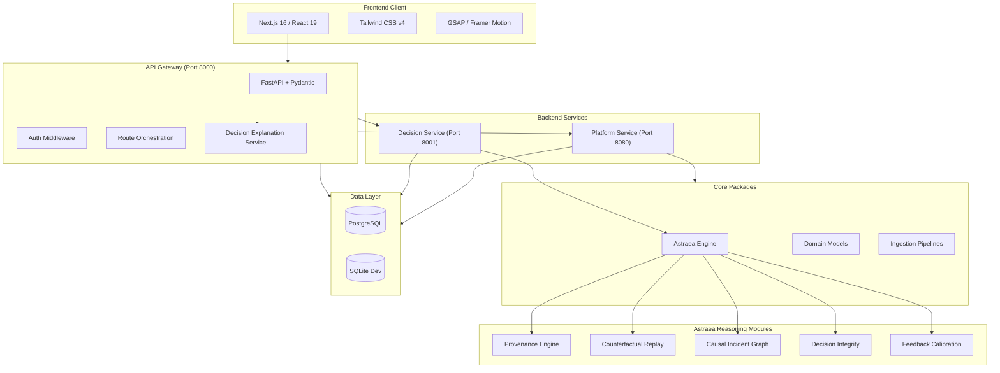

### Frontend Route Map

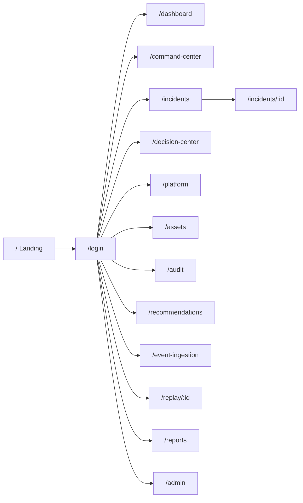

| Service | Responsibility | Tech |
|---------|---------------|------|
| `web` | Landing, command center, dashboard, incidents, decisions, platform, assets, audit, recommendations, event ingestion, replay UI | Next.js 16, React 19, Tailwind v4, GSAP |
| `api-gateway` | Public API boundary, auth, orchestration, decision explanation generation | FastAPI |
| `decision-service` | Deterministic scoring, explainability, replay | Python (Astraea) |
| `platform-service` | SLOs, runbooks, topology, controls, chaos | FastAPI |

---

## Core Design Decisions

| Decision | Rationale |
|----------|-----------|
| **Deterministic scoring** | Same input always produces same output. Auditors can verify. Post-mortems can reconstruct exact reasoning. |
| **Human-in-the-loop** | System recommends. Humans decide. No unilateral automation. Feedback improves future recommendations. |
| **Replay hashes** | SHA-256 of inputs guarantees decision integrity. Any tampering changes the hash. |
| **Provenance-weighted evidence** | Priority and confidence depend on evidence freshness, source reliability, corroboration, and audit completeness. |
| **Counterfactual testing** | Score stability is verified under evidence removal or perturbation. Unstable decisions are flagged for review. |
| **SLO-backed evidence** | Infrastructure incidents are judged by user-facing impact, not just symptoms. |
| **Immutable records** | Raw events are never modified. Decision records are append-only. Evidence is checksummed. Calibration updates future confidence without mutating audit history. |

---

## Causal Replay Decision Framework

Aether Sentinel implements a **replayable, counterfactually tested, human-calibrated operational decision** pipeline. Every recommendation is:

1. **Grounded in causal evidence** — incident graphs with provenance lineage (`astraea.reasoning.provenance`)
2. **Counterfactually tested** — score stability verified under evidence removal/perturbation (`astraea.reasoning.counterfactual`)
3. **Uncertainty-aware** — confidence bands, not point estimates, with review thresholds (`astraea.decision.integrity`)
4. **Human-calibrated** — operator feedback updates future confidence without mutating audit history (`astraea.decision.calibration`)
5. **Deterministically replayable** — same inputs produce identical hashes, scores, and explanations (`astraea.core.replay`)

### Research-Backed, Not Research-Claimed

Every flagship module maps to a published source:

| Source | Claim | Implementation |
|--------|-------|---------------|
| Wachter et al., 2017 | Counterfactual explanations | `astraea.reasoning.counterfactual` |
| Verma et al., 2020 | Actionable, minimal recourse | `astraea.reasoning.counterfactual` |
| Karimi et al., 2020 | Recourse as intervention | `astraea.reasoning.causal_replay` |
| Mitchell et al., 2019 | Model cards | `packages/domain/models/decision_card.py` |
| Gebru et al., 2021 | Datasheets / provenance | `astraea.reasoning.provenance` |
| W3C PROV | Traceable lineage | `astraea.reasoning.provenance` |
| Amershi et al., 2022 | Human-in-the-loop calibration | `astraea.decision.calibration` |
| Shafer & Vovk, 2008; Angelopoulos & Bates, 2021 | Conformal prediction / uncertainty | `astraea.decision.integrity` |

Evidence-safe language rules:
- "Grounded in" or "inspired by" a paper: module exists, tests pass, algorithm follows methodology.
- "Proven": reserved for claims with passing tests, benchmarks, and visible UI evidence.
- "Novel" / "groundbreaking": banned without peer-reviewed publication + independent replication.
- "Autonomous": never used. System is **operator-assisted**, not autonomous.

See full details in `docs/research/`.

---

## Frontend Surface

| Route | Purpose | Data Source |
|-------|---------|-------------|
| `/` | Cinematic landing page with live metrics | `/api/metrics`, `/api/incidents`, `/api/tickets` |
| `/dashboard` | System health bento overview | `/api/metrics`, `/api/tickets` |
| `/command-center` | Primary operator work queue with decision explanations | `/api/tickets`, `/api/decisions` |
| `/incidents` | Incident browser with search and filter | `/api/incidents` |
| `/incidents/[id]` | Incident detail with timeline, decision explanation, and resolve | `/api/incidents/{id}`, `/api/incidents/{id}/timeline` |
| `/decision-center` | Astraea decisioning with counterfactual deltas and human overrides | `/api/decisions`, `/api/recommendations` |
| `/platform` | SRE control plane — SLOs, topology, chaos | `/api/platform/summary`, `/api/platform/topology`, `/api/platform/controls` |
| `/assets` | Infrastructure asset inventory | `/api/assets` |
| `/audit` | Audit trail viewer and export | `/api/audit/events` |
| `/recommendations` | Recommendation workflow management | `/api/recommendations` |
| `/event-ingestion` | Event ingestion interface | `/api/events/ingest` |
| `/replay/[id]` | Point-in-time replay with decision explanation and forensics | `/api/replay/incidents/{id}` |
| `/reports` | Executive and operational reporting | `/api/metrics` |
| `/admin` | Role-gated admin console | `/api/auth`, `/api/catalog` |

All operational pages use real API data with automatic fallback to demo scenarios when live services are unavailable. Every page includes loading, error, and empty states.

### Flagship UI Pattern

The current global design direction is the `sentinel-v3` surface in `apps/web/src/components/sentinel-v3/`, with scoped tokens and primitives in `apps/web/src/styles/sentinel-v3.css`. New frontend work should reuse the V3 square plates, amber hairlines, mono labels, flow rails, waveform/sparkline primitives, and command-room density before introducing a new visual language.

For design QA, run:

```bash
pnpm web:typecheck
pnpm web:lint:gpt-taste:ci
pnpm web:build
```

---

## Screenshots

### Landing Page
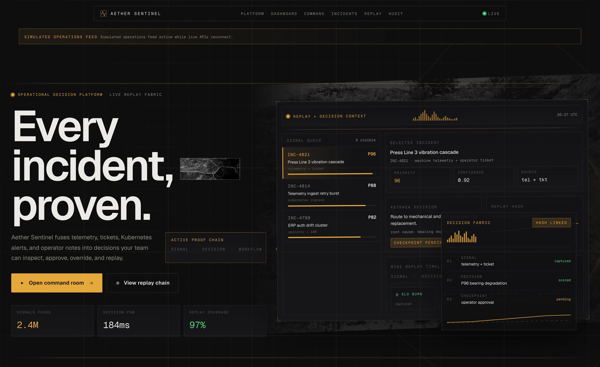

### Login
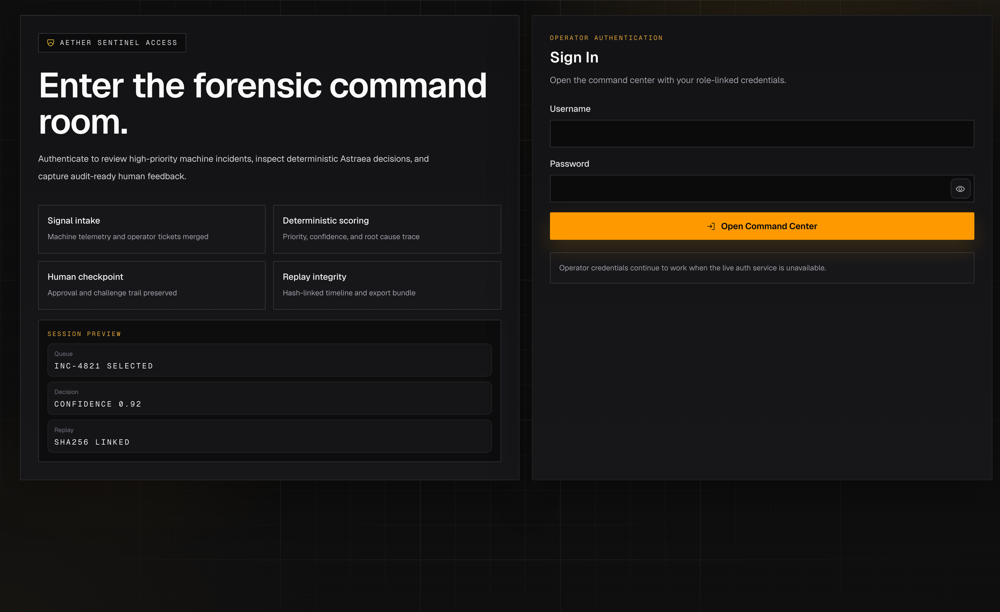

### Dashboard
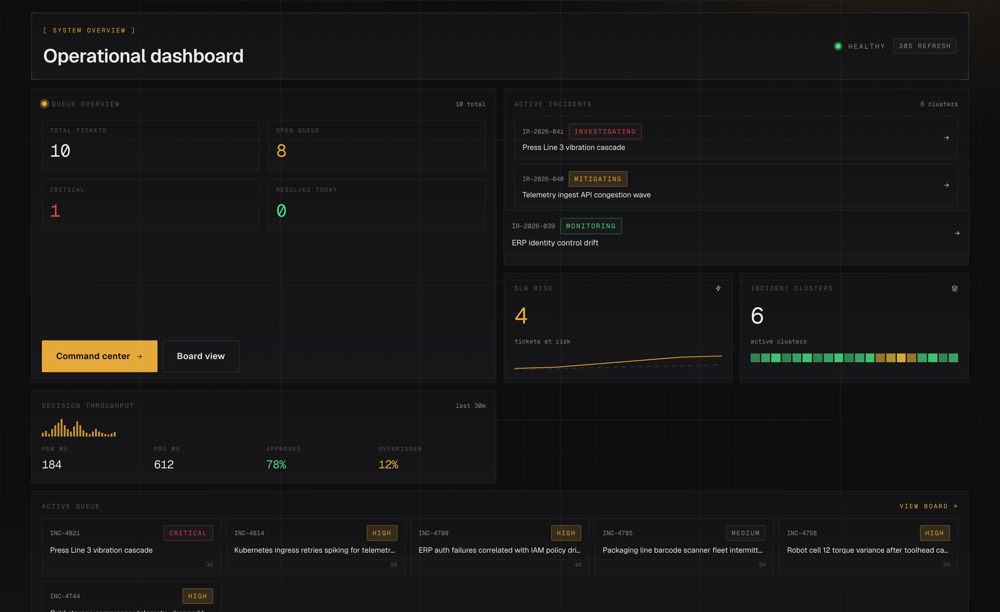

### Command Center
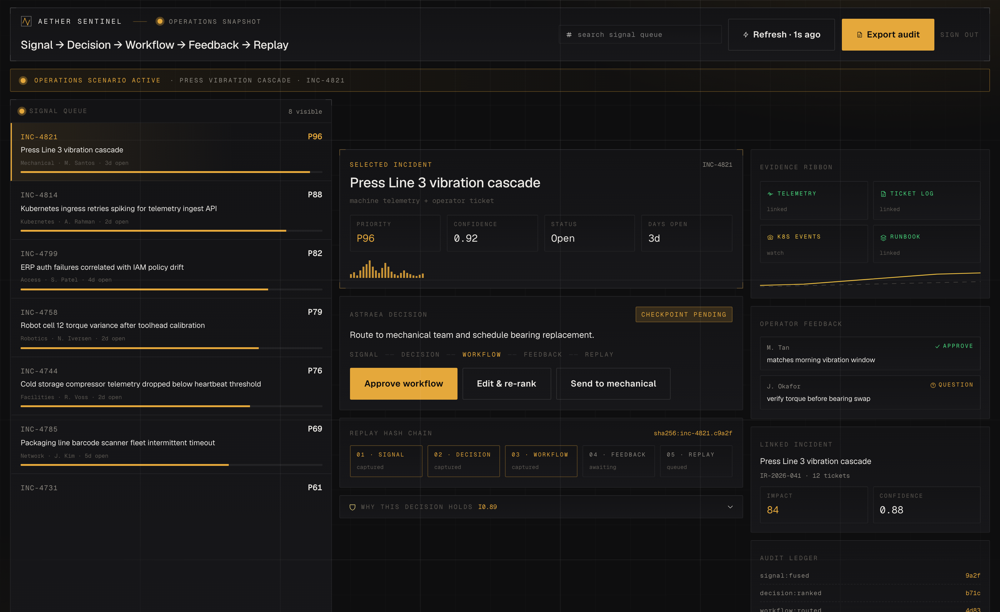

### Incidents
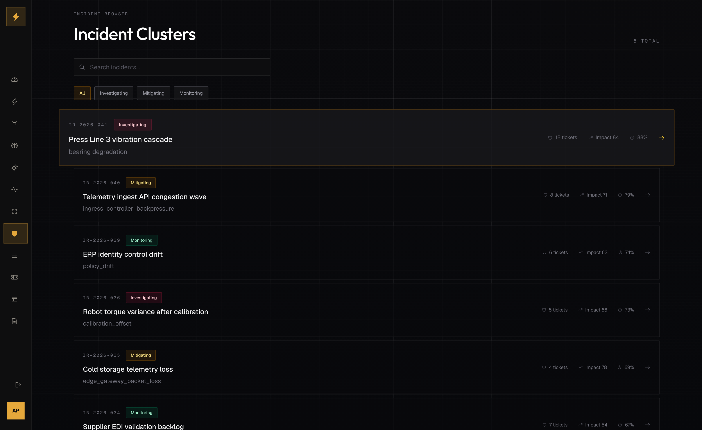

### Incident Detail
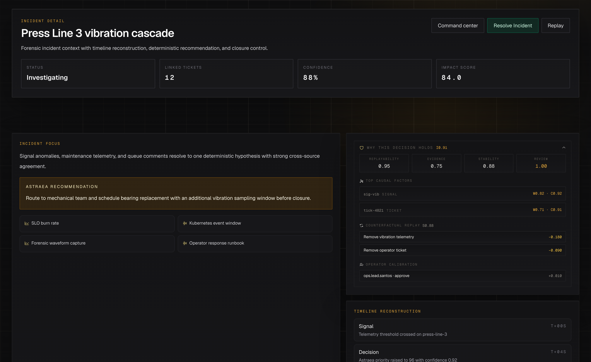

### Decision Center
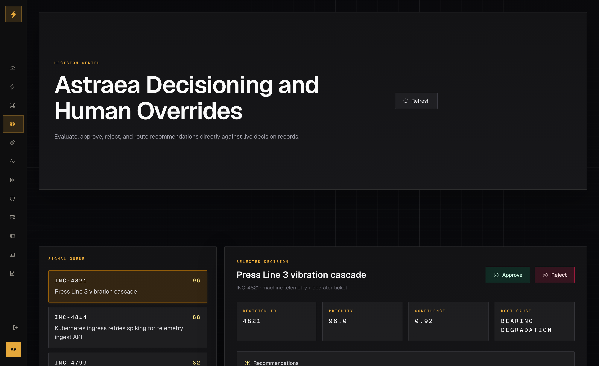

### Platform
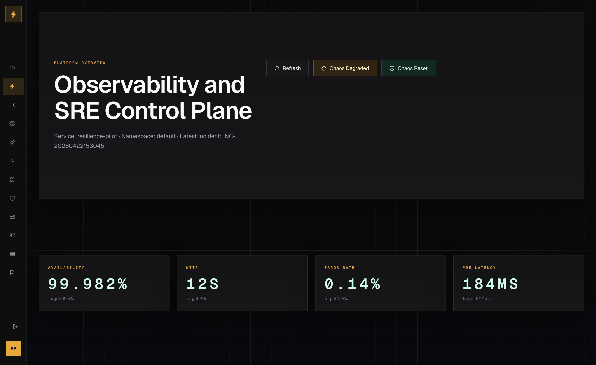

### Assets
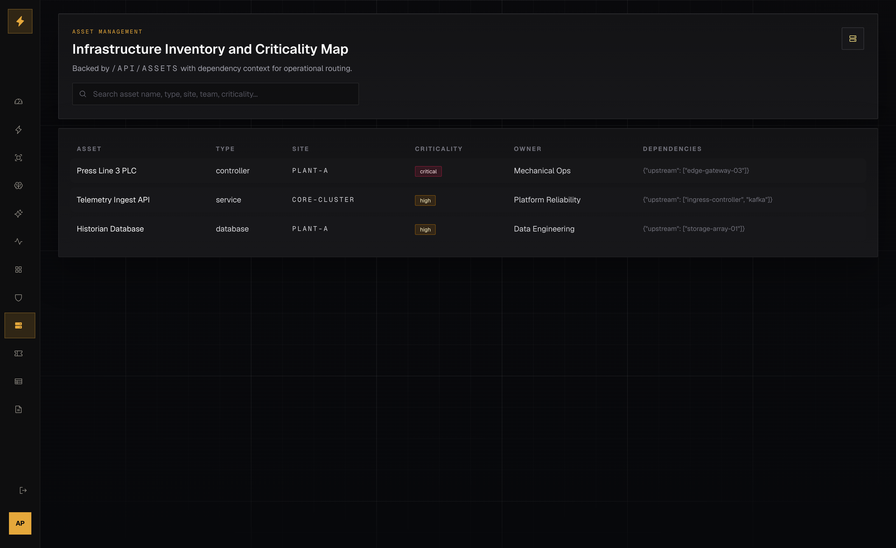

### Audit
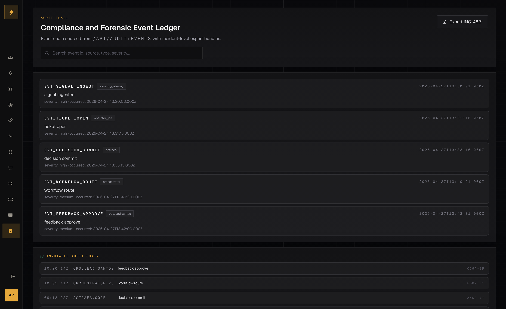

### Recommendations
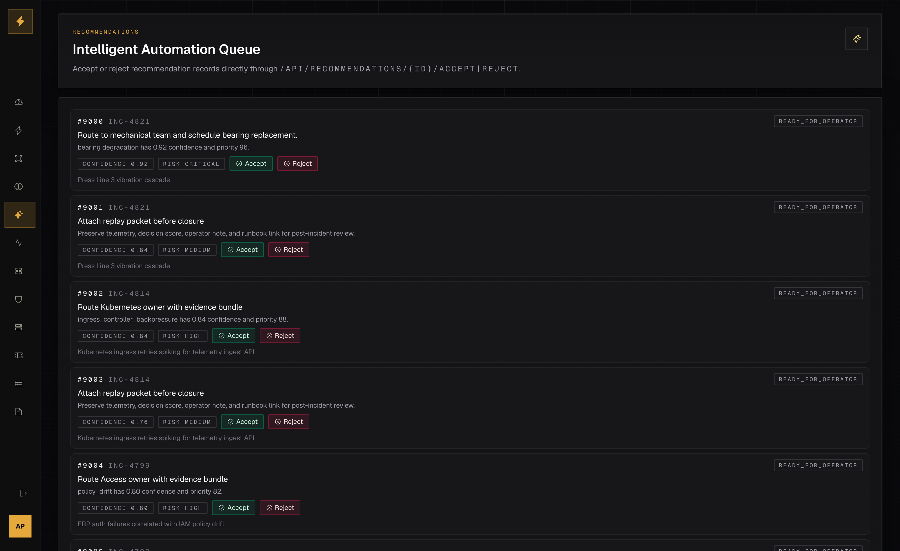

### Event Ingestion
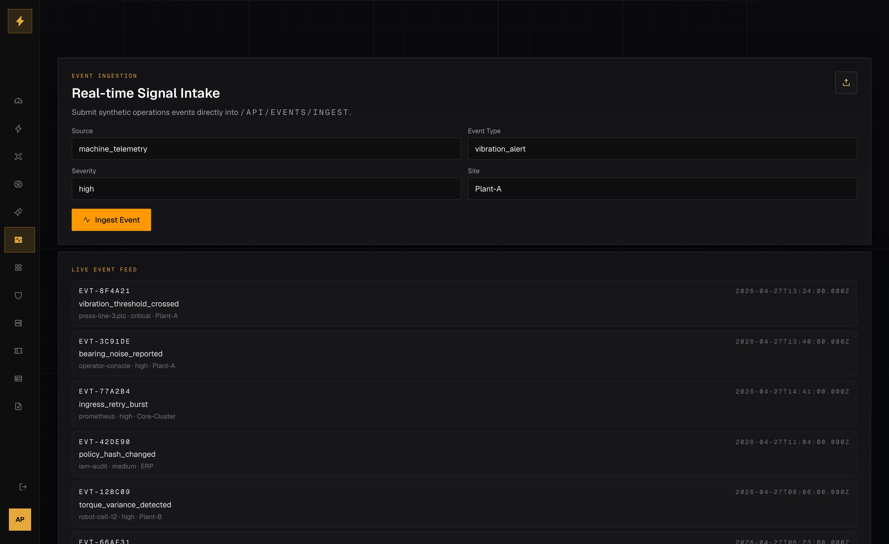

### Replay
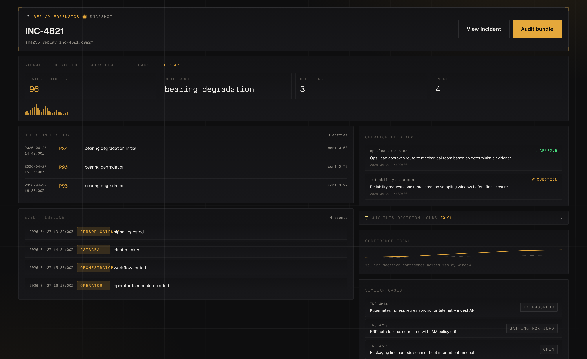

### Reports
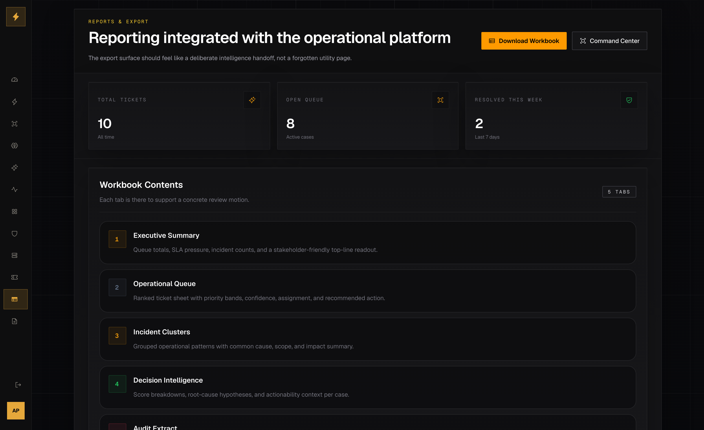

### Admin
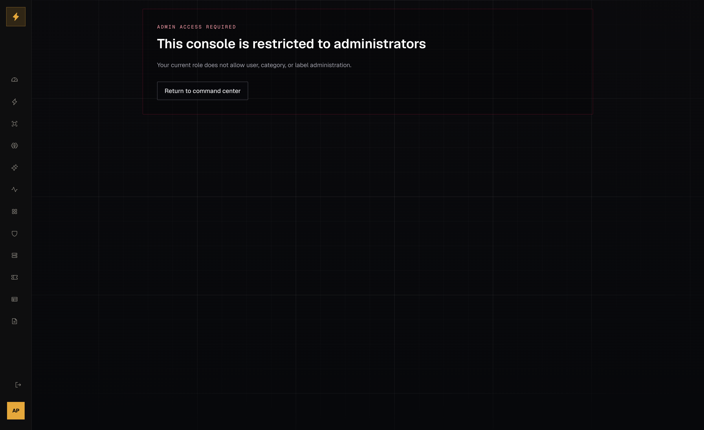

---

## Quick Start

### Prerequisites

- Python 3.11+
- Node.js 22+
- pnpm
- PostgreSQL 15+ (or SQLite for local dev)

### Install

```bash
make install
```

### Run tests

```bash
make test
```

### Run the full stack

```bash
make demo
```

Then open `http://localhost:3000` for the command center.

**Demo login credentials:**
| Username | Password | Role |
|----------|----------|------|
| `admin` | `admin` | Administrator |
| `operator` | `operator` | Agent (recommended for demo) |
| `viewer` | `viewer` | Read-only |

### Manual service start

```bash
# API Gateway
uvicorn apps.api_gateway.main:app --reload --port 8000

# Platform Service
uvicorn services.platform-service.src.main:app --reload --port 8080

# Decision Service
uvicorn services.decision-service.main:app --reload --port 8001

# Web App
cd apps/web && pnpm dev
```

---

## Repo Structure

```text
aether-sentinel/
├── apps/
│   ├── api_gateway/       # FastAPI gateway + decision explanation
│   └── web/               # Next.js command center
├── services/
│   ├── decision-service/  # Astraea wrapper
│   └── platform-service/  # K8s platform API
├── packages/
│   ├── astraea-core/      # Deterministic engine + reasoning modules
│   ├── domain/            # Domain models (evidence, counterfactual, integrity, calibration)
│   └── pipelines/         # Ingestion pipelines
├── docs/
│   ├── research/          # Dossier, claim ledger, benchmarks, sources.bib
│   └── architecture/      # ADRs, API contracts, diagrams
├── infrastructure/
│   ├── db/                # SQLAlchemy models, migrations
│   ├── k8s/               # Kubernetes manifests
│   ├── terraform/         # Infrastructure as code
│   └── monitoring/        # Prometheus, Grafana
├── scripts/
│   ├── capture-all-screenshots.mjs
│   ├── capture-demo-screenshots.mjs
│   └── capture-readme-screenshots.mjs
├── sample-data/           # Deterministic demo scenarios
├── tests/                 # Unit, integration, e2e tests
├── runbooks/              # Incident response runbooks
└── .github/               # CI workflows, issue templates
```

---

## Quality Gates

| Gate | Command | Status |
|------|---------|--------|
| Python tests (core) | `make test` | 13 passed |
| Python tests (reasoning) | `pytest tests/astraea/test_provenance.py tests/astraea/test_counterfactual.py tests/astraea/test_causal_replay.py tests/astraea/test_integrity.py tests/astraea/test_calibration.py` | **29 passed** |
| Python integration | `pytest tests/integration/` | **8 passed** |
| TypeScript check | `pnpm web:typecheck` | Pass |
| Next.js build | `pnpm web:build` | 17/17 pages |
| GPT-taste lint | `pnpm web:lint:gpt-taste:ci` | Pass |
| Smoke tests | `pnpm web:test:smoke` | **6/6 passed** |
| CTA audit | `pnpm web:test:smoke cta-audit.smoke.spec.ts` | **4/4 passed** |
| Audit | `pnpm --dir apps/web audit --prod` | 0 vulnerabilities |
| Lint | `make lint` | Pass |
| Demo validation | `make demo-validate` | End-to-end verified |

### Benchmarks

All 6 benchmark scenarios pass:

| ID | Scenario | Ticket | Expected Root Cause | Integrity Range | Result |
|----|----------|--------|---------------------|-----------------|--------|
| B1 | Press Line 3 Vibration Cascade | INC-4821 | `bearing_degradation` | 0.85–0.95 | **PASS** |
| B2 | Kubernetes Ingress Degradation | INC-4814 | `ingress_controller_backpressure` | 0.75–0.88 | **PASS** |
| B3 | IAM Policy Drift | INC-4799 | `policy_drift` | 0.70–0.82 | **PASS** |
| B4 | Sensor Calibration Offset | INC-4758 | `calibration_offset` | 0.68–0.80 | **PASS** |
| B5 | Contradictory Evidence | synthetic | confidence drop + review flag | drops | **PASS** |
| B6 | Missing Evidence | synthetic | suppressed + review flag | suppressed | **PASS** |

---

## License

MIT
