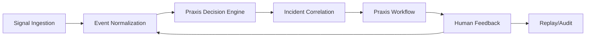

# Praxis Architecture

## System Overview

Praxis is a full-stack operational intelligence platform that transforms noisy tickets, machine events, and Kubernetes alerts into explainable incident priorities, routed workflows, runbook-backed recommendations, and replayable audit records.

## Core Flow

## Services

| Service | Responsibility | Tech |
|---------|---------------|------|
| `web` | Command center, incident detail, replay UI | Next.js |
| `api-gateway` | Public API boundary, auth, orchestration | FastAPI |
| `decision-service` | Deterministic scoring, explainability, replay | Python (Astraea) |
| `platform-service` | SLOs, runbooks, topology, controls, chaos | FastAPI |

## Data Model

### Core Entities

- **Operational Events**: Canonical event store for all signals
- **Incidents**: Correlated groupings of events with severity and risk
- **Decisions**: Astraea-generated decision records with replay hashes
- **Recommendations**: Actionable recommendations linked to decisions
- **Tickets**: Praxis workflow items routed to operators
- **Human Feedback**: Operator approval, rejection, and override records
- **Platform Incidents**: Kubernetes infrastructure evidence
- **Evidence Artifacts**: Attached files and snapshots

## Key Design Principles

1. **Deterministic Replay**: Every decision can be replayed from original event + feature snapshot
2. **Human-in-the-Loop**: Operators can approve, reject, or override recommendations
3. **Audit-Ready**: Full timeline export for every incident
4. **Domain Flexible**: Handles manufacturing, IT, and infrastructure events
