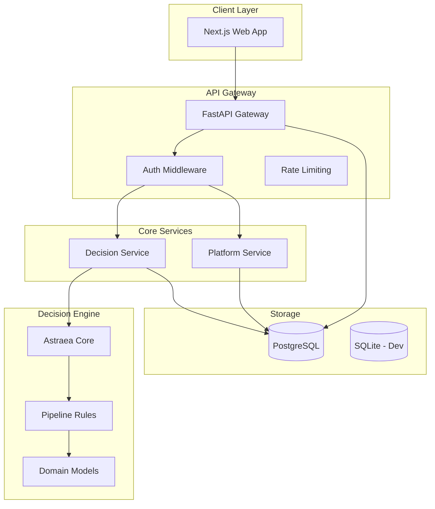

# System Architecture

## Overview

Praxis is organized around a closed operational loop. Signals enter the system, are normalized, scored by the decision engine, routed through workflow, reviewed by humans, and preserved for replay.

## System Context

```mermaid
flowchart LR
    subgraph Sources["Operational Signal Sources"]
        Tickets["Tickets"]
        MachineEvents["Machine Events"]
        K8sAlerts["Kubernetes Alerts"]
        OperatorNotes["Operator Notes"]
    end

    subgraph Ingestion["Ingestion and Normalization"]
        Ingest["Ingest Event"]
        Normalize["Normalize Payload"]
        Validate["Validate Contract"]
        StoreEvent["Store Operational Event"]
    end

    subgraph Decision["Praxis Decision Engine"]
        Features["Extract Features"]
        Score["Score Priority and Risk"]
        Explain["Generate Explanation"]
        Hash["Create Replay Hash"]
    end

    subgraph Workflow["Praxis Workflow Layer"]
        Correlate["Correlate Incident"]
        Ticket["Create or Update Ticket"]
        Route["Route Ownership"]
        Feedback["Capture Human Feedback"]
    end

    subgraph Evidence["Platform Evidence Layer"]
        SLO["SLO Metrics"]
        Runbook["Runbook Mapping"]
        Chaos["Chaos Result"]
        Snapshot["Incident Snapshot"]
    end

    subgraph Audit["Replay and Audit"]
        Timeline["Replay Timeline"]
        Export["Audit Export"]
        Report["Post-Incident Report"]
    end

    Sources --> Ingest
    Ingest --> Normalize
    Normalize --> Validate
    Validate --> StoreEvent
    StoreEvent --> Features
    Features --> Score
    Score --> Explain
    Explain --> Hash
    Hash --> Correlate
    Correlate --> Ticket
    Ticket --> Route
    Route --> Feedback
    Feedback --> StoreEvent
    Evidence --> StoreEvent
    StoreEvent --> Timeline
    Timeline --> Export
    Export --> Report
```

## Service Topology

## Component Responsibilities

### API Gateway (`apps/api_gateway`)
- Route multiplexing
- Authentication and authorization
- Request validation
- Rate limiting
- Response formatting

### Decision Service (`services/decision-service`)
- Feature extraction
- Priority scoring
- Confidence calculation
- Explanation generation
- Replay hash computation

### Platform Service (`services/platform-service`)
- Kubernetes SLO monitoring
- Evidence artifact collection
- Infrastructure snapshotting
- Runbook mapping

### Astraea Core (`packages/astraea-core`)
- Deterministic scoring engine
- Rule evaluation
- Feature vector construction
- Decision versioning

### Domain Models (`packages/domain`)
- Shared types
- Policy definitions
- Validation rules

### Pipelines (`packages/pipelines`)
- Ingestion normalizers
- Decision policies
- Report generators
- Similar case retrieval

## Data Flow

1. **Signal Ingestion**: Raw events arrive via REST API
2. **Normalization**: Events are converted to canonical operational event format
3. **Feature Extraction**: Relevant features are extracted from the normalized event
4. **Decision Scoring**: Astraea scores priority, confidence, and risk
5. **Incident Correlation**: Related events are grouped into incidents
6. **Workflow Routing**: Tickets are created and assigned
7. **Human Review**: Operators accept, reject, or override recommendations
8. **Evidence Attachment**: Platform evidence is linked to incidents
9. **Replay Preservation**: Full timeline is stored for future audit

## Deployment Model

The system is designed for Kubernetes deployment with:
- Horizontal Pod Autoscaling
- Pod Disruption Budgets
- Network Policies
- ConfigMap-based configuration
- Secret management
- Persistent volumes for evidence storage
