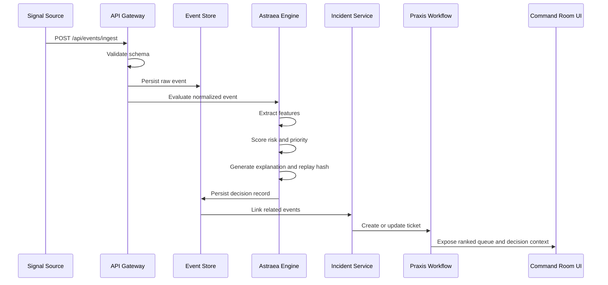

# Deterministic Decisioning

## Why Determinism

Operational systems need repeatable decisions because incidents are reviewed after the fact. If a decision engine produces different scores for the same input on different days, operators cannot trust it, auditors cannot verify it, and post-mortems become speculative.

Astraea is designed to be **deterministic**: given the same input, it produces the same output.

## Decision Inputs

Astraea evaluates each normalized event against a feature vector:

| Feature | Description | Weight |
|---------|-------------|--------|
| Severity | Normalized severity (critical=1.0, high=0.75, medium=0.5, low=0.25) | High |
| Urgency | Time-sensitivity based on SLA | High |
| Business Impact | Revenue or operational criticality | High |
| SLA Risk | Days until SLA breach | Medium |
| Recurrence | Frequency of similar past events | Medium |
| Dependency Criticality | Number of downstream dependencies | Medium |
| Actionability | Clarity of next action | Low |
| Uncertainty Penalty | Confidence discount for incomplete data | Adjusting |

## Decision Outputs

For every event, Astraea produces:

```python
class DecisionRecord:
    decision_id: str
    event_id: str
    priority_score: float        # 0-100
    confidence_score: float      # 0-1
    severity_score: float        # 0-1
    urgency_score: float         # 0-1
    business_impact_score: float # 0-1
    sla_risk_score: float        # 0-1
    recurrence_score: float      # 0-1
    dependency_criticality_score: float # 0-1
    actionability_score: float   # 0-1
    uncertainty_penalty: float   # 0-1
    root_cause_hypothesis: str
    replay_hash: str             # SHA-256 of inputs
    explanation: dict            # Human-readable rationale
    decision_version: str        # Rule version
    feature_snapshot: dict       # Feature vector at decision time
```

## Replay Hash

The replay hash is a SHA-256 checksum computed from:
- Normalized event payload
- Feature snapshot
- Decision rule version
- Decision engine version

This hash guarantees that:
1. The same inputs always produce the same hash
2. Any change in inputs or rules produces a different hash
3. The decision can be independently verified

## Deterministic Replay Contract

Given:
- Same input event
- Same feature snapshot
- Same rule version
- Same engine version

The system guarantees:
- Same priority score
- Same confidence score
- Same recommendation
- Same replay hash

## Tradeoff

Determinism sacrifices some model flexibility in exchange for:
- **Auditability**: Decisions can be independently verified
- **Repeatability**: Post-mortems can reconstruct exact reasoning
- **Operator trust**: Humans can understand why a decision was made
- **Regulatory compliance**: Financial and safety-critical industries require explainable decisions

## Non-Deterministic Components

Some components are intentionally non-deterministic:
- **Similar case retrieval**: Uses fuzzy matching
- **Incident correlation**: Uses threshold-based grouping
- **Human feedback**: By definition, human judgment varies

These components are tracked separately and do not affect the core decision hash.

## Signal-to-Decision Flow



## Why It Matters

Deterministic decisioning turns incident prioritization from guesswork into engineering. Operators can verify decisions. Auditors can reconstruct them. Post-mortems can reference them.

## Failure Modes

- **Hash collision**: SHA-256 collision is cryptographically negligible but documented
- **Version drift**: Old decisions reference outdated rule versions. Migration scripts handle re-evaluation.
- **Feature snapshot corruption**: Stored as immutable JSONB. Corruption would be detected by hash mismatch.

## Verification

- Unit test: `test_replay_hash_stability` - same input produces same hash
- Unit test: `test_replay_hash_sensitivity` - different input produces different hash
- Integration test: `test_replay_decision` - replay returns identical decision

## Versioning

Decision rules are versioned. When rules change:
- A new version is created
- Old decisions retain their original version
- Replay uses the version that was active at decision time
- Migration scripts can re-evaluate historical events with new rules
