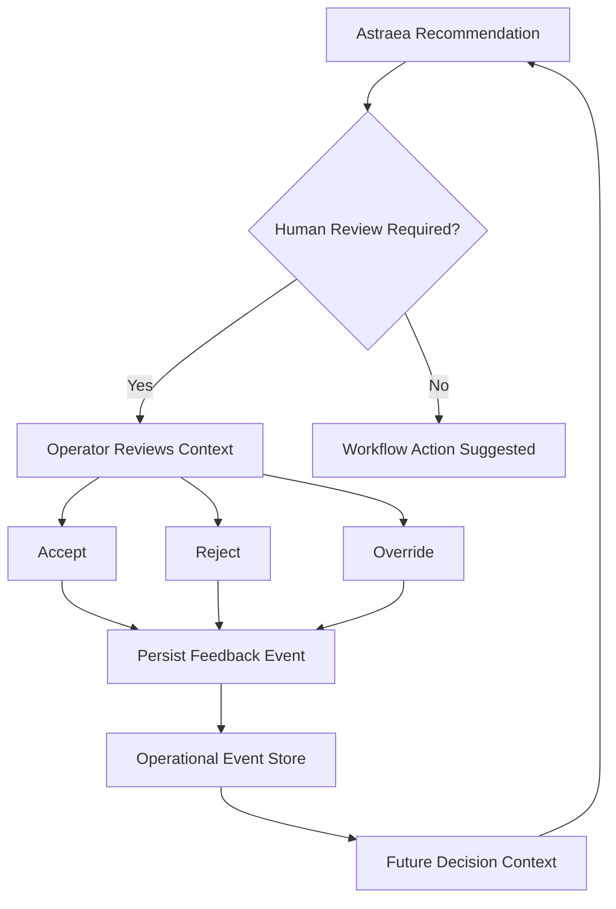

# Human-in-the-Loop Control

## Control Philosophy

Praxis recommends action, but the operator approves, rejects, or overrides.

This is not a limitation. It is a design choice.

## Why Human Review Exists

1. **Uncertainty can be high**
   Even with 95% confidence, the 5% uncertainty matters when the consequence is a production outage.

2. **Operational context may be incomplete**
   The system sees tickets and metrics. It does not see hallway conversations, vendor emails, or pending change requests.

3. **Automated remediation can create secondary failures**
   Restarting a service might fix latency but break an in-flight batch job.

4. **Human judgment becomes feedback for future prioritization**
   When an operator overrides a recommendation, the system learns what the operator values.

## Feedback Types

| Feedback | Description | Effect |
|----------|-------------|--------|
| Accept | Operator agrees with recommendation | Decision is executed |
| Reject | Operator disagrees | Alternative action is taken |
| Override Priority | Operator changes priority | New priority is recorded with rationale |
| Override Owner | Operator reassigns | New owner is recorded |
| False Positive | Event is not a real incident | Event is marked and used for model improvement |
| Attach Note | Operator adds context | Note is preserved in audit trail |

## Feedback Loop

Human feedback enters the system as a new operational event:

```
Operator Feedback -> Event Store -> Feature Update -> Future Decision Context
```

This means:
- Feedback is timestamped
- Feedback is attributed to an operator
- Feedback is linked to the original decision
- Feedback influences future similar decisions

## Interface Design

The feedback interface is designed for speed:
- One-click accept/reject
- Optional override with dropdown
- Optional note with quick-select templates
- All actions are reversible within 5 minutes

## Escalation Rules

Some decisions require mandatory human review:
- Critical severity + high business impact
- Unknown asset + high uncertainty
- Recurring incident + previous false positive
- Any decision with confidence below 0.7

These rules are configurable per deployment.

## Feedback Loop Diagram



## Why It Matters

Human-in-the-loop control prevents automated secondary failures and builds operator trust. Every piece of feedback improves future recommendations.

## Failure Modes

- **Operator override without note**: System requires optional note but does not enforce it
- **Feedback loop delay**: Feedback may take hours to enter the system. Real-time decisions use stale context.
- **False positive fatigue**: Too many low-value alerts cause operators to bulk-reject. Threshold tuning addresses this.

## Verification

- Integration test: `test_feedback_approve` - feedback is persisted and retrievable

## Metrics

The system tracks:
- Acceptance rate by decision type
- Override rate by operator
- Time to review by severity
- False positive rate by source
- Feedback-to-resolution correlation

These metrics help tune the decision engine and identify where human judgment adds the most value.
