# Replayability and Auditability

## The Audit Question

After an incident, the system must answer:

1. What did we know?
2. When did we know it?
3. What did we recommend?
4. Who acted?
5. Why?

Praxis answers all five questions from a single incident record.

## Replay Inputs

To reconstruct an incident, the system needs:

| Input | Source | Purpose |
|-------|--------|---------|
| Raw event | Event store | Original signal |
| Normalized payload | Event store | Canonical representation |
| Feature snapshot | Decision record | What the engine saw |
| Decision version | Decision record | Which rules were active |
| Recommendation | Decision record | What was suggested |
| Operator feedback | Feedback record | What the human decided |
| Platform evidence | Evidence store | Infrastructure context |
| Timeline | Event store | Sequence of actions |

## Replay Output

A replay produces:

```python
class ReplayBundle:
    incident_id: str
    events: List[OperationalEvent]
    decisions: List[DecisionRecord]
    recommendations: List[Recommendation]
    feedback: List[HumanFeedback]
    evidence: List[EvidenceArtifact]
    timeline: List[TimelineEvent]
    resolution: ResolutionRecord
    audit_hash: str
```

For the operational-resilience spine, `/api/decisions/{decision_id}/replay` now does more than return stored rows. It:

1. loads the original `operational_events` row
2. rebuilds the asset blast radius from `asset_edges`
3. recomputes the pure Astraea decision
4. re-hashes the canonical decision bundle
5. returns both stored and replayed hashes plus a `determinism` boolean

## Timeline Reconstruction

The timeline is reconstructed from:
- Event timestamps
- Decision timestamps
- Workflow action timestamps
- Feedback timestamps
- Evidence attachment timestamps

This creates a complete chronological record of the incident lifecycle.

## Audit Export

The audit export produces a structured document:

```json
{
  "incident_id": "INC-2024-001",
  "summary": "Press vibration cascade",
  "timeline": [
    {"timestamp": "2024-01-15T08:30:00Z", "event": "Sensor alert", "source": "machine"},
    {"timestamp": "2024-01-15T08:31:00Z", "event": "Decision scored", "priority": 87},
    {"timestamp": "2024-01-15T08:32:00Z", "event": "Ticket created", "assignee": "ops-team"},
    {"timestamp": "2024-01-15T08:45:00Z", "event": "Operator accepted recommendation"},
    {"timestamp": "2024-01-15T09:15:00Z", "event": "Resolution confirmed"}
  ],
  "decisions": [
    {"decision_id": "DEC-001", "priority_score": 87, "confidence": 0.92, "replay_hash": "abc123..."}
  ],
  "feedback": [
    {"operator": "alice", "feedback_type": "accept", "note": "Correct priority"}
  ],
  "evidence": [
    {"type": "slo_snapshot", "availability": 0.95, "p95_latency_ms": 120}
  ]
}
```

## Why This Matters

Replayability turns the project from a dashboard into an **accountable operational system**.

Without replay:
- Post-mortems are based on memory and incomplete logs
- Regulatory audits require manual document collection
- Similar incidents are handled inconsistently
- Operator training lacks concrete examples

With replay:
- Post-mortems are data-driven
- Regulatory audits are one-click exports
- Similar incidents share context automatically
- Operator training uses real historical decisions

## Replay and Audit Flow

```mermaid
flowchart LR
    Raw["Raw Event"] --> Norm["Normalized Payload"]
    Norm --> Feature["Feature Snapshot"]
    Feature --> Decision["Decision Record"]
    Decision --> Recommendation["Recommendation"]
    Recommendation --> Ticket["Ticket Action"]
    Ticket --> Feedback["Human Feedback"]
    Feedback --> Evidence["Platform Evidence"]
    Evidence --> Replay["Replay Timeline"]
    Replay --> Export["Audit Export"]
```



## Why It Matters

Replayability turns the project from a dashboard into an **accountable operational system**.

Without replay:
- Post-mortems are based on memory and incomplete logs
- Regulatory audits require manual document collection
- Similar incidents are handled inconsistently
- Operator training lacks concrete examples

With replay:
- Post-mortems are data-driven
- Regulatory audits are one-click exports
- Similar incidents share context automatically
- Operator training uses real historical decisions

## Failure Modes

- **Missing evidence**: Platform service downtime may leave gaps in SLO evidence
- **Timeline reconstruction error**: Clock skew across services can distort ordering. NTP sync is required.
- **Audit export size**: Large incidents produce large exports. Streaming export handles this.

## Verification

- Integration test: `test_audit_export` - audit export returns structured document
- Integration test: `test_graph_aware_replay_is_deterministic` - graph-backed replay recomputes the same hash

## Immutable Records

All replay inputs are immutable:
- Raw events are never modified
- Decision records are append-only
- Feedback is timestamped and attributed
- Evidence artifacts are checksummed

This immutability guarantee means that a replay from today will produce the same result as a replay from next year.
