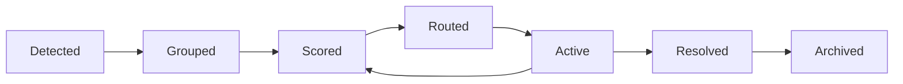

# Incident Correlation Theory

## The Deduplication Problem

Multiple signals often describe the same underlying incident:

- A machine sensor reports vibration
- A ticket is created for "unusual noise"
- A Kubernetes alert fires for the associated service
- An operator adds a note about the same asset

Without correlation, the system treats these as four separate incidents. With correlation, it recognizes one incident with four signals.

## Correlation Dimensions

Praxis correlates events across multiple dimensions:

### Asset Dimension
Events affecting the same asset are candidates for correlation.

### Temporal Dimension
Events within a configurable time window (default: 30 minutes) are candidates.

### Semantic Dimension
Events with similar root cause hypotheses are candidates.

### Dependency Dimension
Events affecting upstream or downstream dependencies are candidates.

## Correlation Algorithm

```python
def correlate_events(events: List[Event]) -> List[Incident]:
    candidates = group_by_asset(events)
    candidates = filter_by_time_window(candidates, window_minutes=30)
    candidates = score_by_semantic_similarity(candidates)
    candidates = score_by_dependency_proximity(candidates)
    return create_incidents(candidates, threshold=0.75)
```

## Correlation Score

The correlation score is a weighted combination:

```
score = 0.4 * asset_match + 0.3 * temporal_proximity + 0.2 * semantic_similarity + 0.1 * dependency_proximity
```

Events with score > 0.75 are grouped into the same incident.

## Incident Lifecycle



### Detected
Initial signal received. Incident record created.

### Grouped
Related events correlated. Incident enriched with context.

### Scored
Astraea scores incident priority and confidence.

### Routed
Ticket created and assigned based on rules and workload.

### Active
Operator is working the incident. Feedback is captured.

### Resolved
Root cause addressed. Evidence preserved.

### Archived
Incident is closed. Available for replay and learning.

## Confidence Decay

As an incident ages without new signals, correlation confidence decays:

- **0-30 minutes**: Full confidence
- **30-60 minutes**: 75% confidence
- **60-120 minutes**: 50% confidence
- **>120 minutes**: New events create separate incidents

This prevents stale incidents from absorbing unrelated new events.

## False Positive Handling

When an operator marks an event as a false positive:
- The event is removed from the incident
- The incident is re-evaluated
- The false positive is recorded for model improvement
- Similar future events receive adjusted confidence

## Metrics

The system tracks:
- Correlation accuracy (operator-validated)
- False positive rate by source
- Average incident size (number of correlated events)
- Time from first signal to incident creation
- Time from incident creation to resolution
