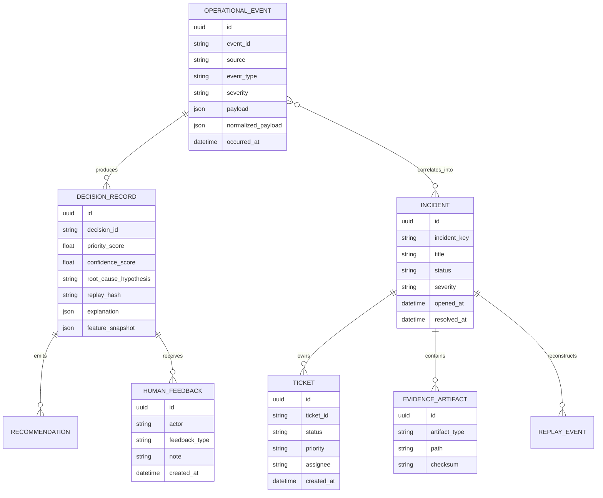

# Data Model

## Entity Relationships

## Core Tables

### operational_event
Stores all ingested signals in normalized form.

| Column | Type | Description |
|--------|------|-------------|
| id | UUID | Primary key |
| event_id | VARCHAR | Unique event identifier |
| source | VARCHAR | Origin system |
| event_type | VARCHAR | Normalized type |
| severity | VARCHAR | Normalized severity |
| asset_id | VARCHAR | Affected asset |
| payload | JSONB | Raw source data |
| normalized_payload | JSONB | Canonical form |
| occurred_at | TIMESTAMP | Event time |
| created_at | TIMESTAMP | Ingestion time |

### decision_record
Stores Astraea decisions with replay context.

| Column | Type | Description |
|--------|------|-------------|
| id | UUID | Primary key |
| event_id | VARCHAR | Linked event |
| priority_score | FLOAT | 0-100 priority |
| confidence_score | FLOAT | 0-1 confidence |
| root_cause_hypothesis | TEXT | Generated hypothesis |
| replay_hash | VARCHAR | SHA-256 of inputs |
| explanation | JSONB | Human-readable rationale |
| feature_snapshot | JSONB | Feature vector |
| decision_version | VARCHAR | Rule version |
| created_at | TIMESTAMP | Decision time |

### incident
Stores correlated incident groups.

| Column | Type | Description |
|--------|------|-------------|
| id | UUID | Primary key |
| incident_key | VARCHAR | Unique incident ID |
| title | VARCHAR | Incident title |
| status | VARCHAR | Lifecycle status |
| severity | VARCHAR | Aggregated severity |
| root_cause | TEXT | Determined root cause |
| opened_at | TIMESTAMP | Creation time |
| resolved_at | TIMESTAMP | Resolution time |

### human_feedback
Stores operator feedback on decisions.

| Column | Type | Description |
|--------|------|-------------|
| id | UUID | Primary key |
| decision_id | UUID | Linked decision |
| actor | VARCHAR | Operator username |
| feedback_type | VARCHAR | accept/reject/override |
| note | TEXT | Optional context |
| created_at | TIMESTAMP | Feedback time |

### evidence_artifact
Stores platform evidence linked to incidents.

| Column | Type | Description |
|--------|------|-------------|
| id | UUID | Primary key |
| incident_id | UUID | Linked incident |
| artifact_type | VARCHAR | slo/runbook/chaos/snapshot |
| path | VARCHAR | Storage location |
| checksum | VARCHAR | SHA-256 |
| metadata | JSONB | Type-specific data |
| created_at | TIMESTAMP | Attachment time |

## Indexing Strategy

- **operational_event**: event_id (unique), source, severity, occurred_at
- **decision_record**: event_id, replay_hash (unique), created_at
- **incident**: incident_key (unique), status, severity, opened_at
- **human_feedback**: decision_id, actor, created_at
- **evidence_artifact**: incident_id, artifact_type

## Partitioning

- **operational_event**: Partitioned by month on created_at
- **decision_record**: Partitioned by month on created_at
- **incident**: Partitioned by quarter on opened_at

## Data Retention

- **Raw events**: 2 years
- **Decision records**: 2 years
- **Incidents**: 5 years
- **Replay bundles**: 5 years
- **Evidence artifacts**: 1 year (SLO data ages out)
