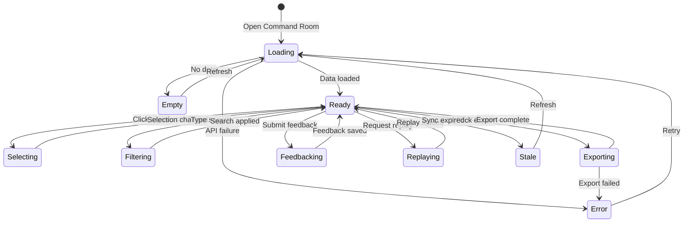

# Frontend UX Rationale

## Design Philosophy

The Aether Sentinel frontend is a **control room**, not a dashboard.

A dashboard displays information for consumption. A control room enables action, accountability, and auditability.

## Product Narrative

The UI is organized around the operational intelligence lifecycle:

```
Signal -> Decision -> Workflow -> Feedback -> Replay
```

Every screen reinforces this narrative. Users do not browse metrics. They inspect signals, review decisions, route work, provide feedback, and replay incidents.

## Layout Principles

### Asymmetric Grid
The command room uses an asymmetric grid that emphasizes the signal queue and decision context over secondary metrics.

### Z-Depth Hierarchy
- Primary actions: elevated, high contrast
- Secondary context: recessed, low contrast
- Tertiary metadata: minimal, monochrome

### Motion as Feedback
Motion is used only to communicate state change:
- Queue items animate on reorder to show priority changes
- Decision panels animate on selection to show context switch
- Status pulses animate to show live system health

## Color System

### Primary Accent: Amber
Amber is the only primary accent color. It represents:
- Active decisions
- Pending actions
- System attention

### Semantic Colors
- **Rose**: Danger, critical incidents, errors
- **Emerald**: Verified recovery, accepted recommendations, healthy state
- **Zinc**: Neutral context, metadata, inactive state

No purple, cyan, or pink accents exist in the operational UI. These colors are reserved for non-operational contexts only.

## Typography

### Font Stack
- **Sans**: Geist - clean, technical, readable at small sizes
- **Mono**: Geist Mono - used for IDs, hashes, timestamps, scores, and SLO values
- **Display**: Outfit - used for landing page headlines and cinematic sections

### Type Scale
- Display headings: `clamp(3rem, 5vw, 5.5rem)`, tight leading
- Eyebrow labels: 10px, uppercase, wide tracking (0.19em)
- Section headings: 18-24px, semibold
- Body text: 13-14px, regular
- Mono data: 11-13px, tabular numbers

## Component Discipline

### Component Boundaries
Each component has a single responsibility:
- `SignalQueue` displays and filters ranked events
- `IncidentDetailPanel` shows case metadata and linked incidents
- `DecisionExplanationPanel` renders Astraea scores and rationale
- `ReplayTimeline` reconstructs incident chronology
- `PlatformSLOPanel` displays SLO metrics and topology
- `AuditTrail` renders immutable audit events

### State Isolation
- Page components orchestrate data fetching
- UI components receive data via props
- Motion components are leaf nodes with no children

### Accessibility
- All interactive elements have focus states
- Color is never the sole indicator of state
- Motion respects `prefers-reduced-motion`
- All buttons have tactile active states

## Mobile Behavior

The control room collapses to a single column on mobile:
- Signal queue becomes a scrollable list
- Detail panels become bottom sheets
- Actions move to a floating action button
- Status rail becomes a bottom navigation bar

## Performance

### Loading States
Every async operation has a defined loading state:
- Skeleton placeholders for known shapes
- Spinner for unknown shapes
- Progressive disclosure for large datasets

### Error States
Every async operation has a defined error state:
- Inline retry for recoverable errors
- Full-page error for unrecoverable errors
- Degraded mode for partial failures

### Empty States
Every list has a meaningful empty state:
- Contextual message explaining why empty
- Suggested action to populate
- Link to documentation

## Resilient Data Fetching

All operational pages use a shared `client-api.ts` helper with:
- Request timeouts (8s default)
- Automatic fallback to demo scenarios when APIs return empty or 404
- Stale cache reuse when possible
- Hard error only when no fallback path exists

This ensures the demo never shows a broken interface, even when backend services are offline.

## Frontend State Machine



## Why This Approach

Traditional dashboard UIs optimize for information density. Control room UIs optimize for decision velocity.

Aether Sentinel optimizes for:
1. **Speed to decision**: Priority-ranked queue, one-click actions
2. **Decision confidence**: Explanations, scores, evidence
3. **Decision accountability**: Feedback, replay, audit
4. **Decision learning**: Historical patterns, operator preferences

This is the difference between looking at data and operating a system.
