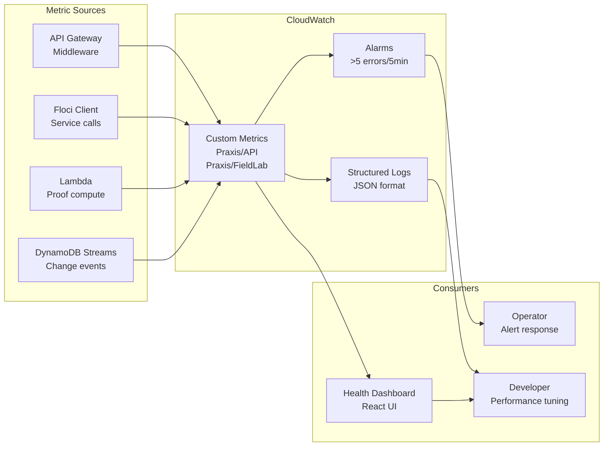

# CloudWatch Observability

Praxis sends custom metrics and structured logs to CloudWatch for operational visibility, alerting, and performance tuning.



## Metrics Namespace

All Praxis metrics live under `Praxis/API` and `Praxis/FieldLab`.

### API Metrics (emitted by `MetricsMiddleware`)

| Metric | Unit | Description |
|--------|------|-------------|
| `{method}_{path}_duration` | Milliseconds | Per-endpoint response time |
| `{method}_{path}_count` | Count | Per-endpoint request count |
| `{method}_{path}_errors` | Count | Per-endpoint error count |

### FieldLab Metrics (emitted by `CloudWatchLogger`)

| Metric | Unit | Description |
|--------|------|-------------|
| `{service}/initialized` | Count | Service client created |
| `Errors/{type}` | Count | Categorized error tracking |
| `dynamodb_streams/enabled` | Count | Streams enabled for state table |
| `lambda_compute_success` | Count | Successful Lambda invocation |

## Structured Logging

Every API request emits a JSON log entry via `CloudWatchMiddleware`:

```json
{
  "timestamp": 1778775052.734,
  "method": "GET",
  "path": "/api/proofs/manufacturing-printer-gpo",
  "status_code": 200,
  "duration_ms": 12.44
}
```

Logs are printed to stdout in development and routed to CloudWatch Logs in production.

## Alarms

| Alarm | Threshold | Action |
|-------|-----------|--------|
| `praxis-proof-compute-errors` | >5 errors in 5 minutes | Operator alert |
| Per-endpoint error rate | >10% in 1 minute | Investigate |

## Querying Metrics

```python
# From floci_client.py
client = FlociClient()
client.cw.log_metric("api/proof_compute_duration", 85.3, "Milliseconds")
client.cw.log_error("proof_generation_failed")
```
