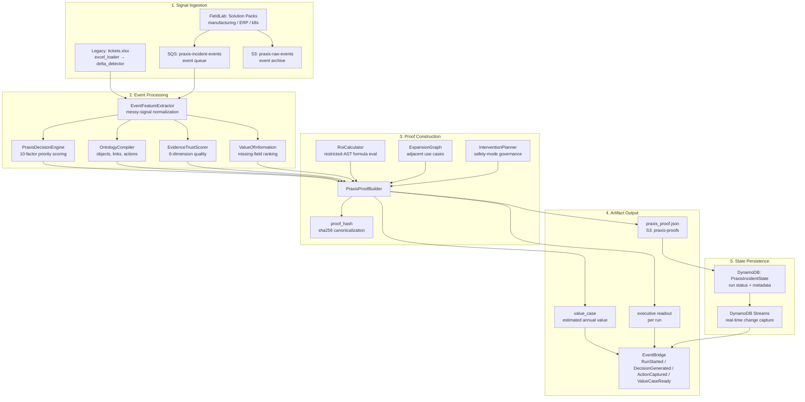

# Praxis Data Flow

The full data pipeline from raw operational signals through to deterministic proofs and executive readouts.

## FieldLab Ingestion (Primary Path)

1. **Solution Pack** loads 12+ messy operational signals per scenario
2. `FlociEventSink.send_batch()` → SQS queue `praxis-incident-events`
3. `FlociEventSink.archive_raw_events()` → S3 bucket `praxis-raw-events`
4. `FlociWorkflowBus.emit()` → EventBridge event `FieldLabRunEventsIngested`

## Feature Extraction

`EventFeatureExtractor` normalizes raw events into structured decision inputs:
- Severity scoring (critical → 1.0, high → 0.9, medium → 0.6, low → 0.3)
- Business impact extraction (shipments, downtime, blocked orders)
- Root cause hypothesis derivation
- Recurrence count, vendor escalation, support escalation flags
- Workaround detection

## Proof Construction

`PraxisProofBuilder` orchestrates the full algorithm stack:
1. Feature extraction from raw events
2. Ontology compilation (objects, links, actions)
3. 10-factor decision scoring (severity, business impact, evidence trust, etc.)
4. ROI calculation via restricted AST evaluation
5. VOI ranking of missing fields
6. Expansion graph for adjacent use cases
7. Intervention planner with safety-mode governance
8. Proof hash via SHA-256 canonical JSON serialization

## Determinism Guarantee

Same solution pack + same events → same proof hash. The canonical JSON serializer normalizes floats, sorts keys, and strips mutable fields from the hash payload.
