# Praxis Decision Engine

The `PraxisDecisionEngine` performs deterministic 10-factor priority scoring backed by evidence trust grading.

```mermaid
flowchart LR
    subgraph Inputs["Input Signals"]
        Features["EventFeatureExtractor<br/>normalized features"]
        Ontology["OntologyCompiler<br/>objects + links"]
        Context["Customer Context<br/>business metrics"]
    end

    subgraph Engine["PraxisDecisionEngine"]
        direction TB
        Severity["1. Severity Score<br/>critical=1.0, high=0.9, ..."]
        Impact["2. Business Impact<br/>shipments, downtime, orders"]
        Trust["3. Evidence Trust<br/>6-dimension quality"]
        Recurrence["4. Recurrence<br/>repeat event count"]
        Escalation["5. Escalation<br/>vendor + support flags"]
        RootCause["6. Root Cause<br/>identified vs unknown"]
        Workaround["7. Workaround<br/>available vs none"]
        OntologyMap["8. Ontology Mapping<br/>objects + links completeness"]
        ValueEstimate["9. Value Estimate<br/>ROI from RoiCalculator"]
        CustomerFit["10. Customer Fit<br/>context match score"]

        Severity --> Priority["Priority Score<br/>weighted ensemble"]
        Impact --> Priority
        Trust --> Priority
        Recurrence --> Priority
        Escalation --> Priority
        RootCause --> Priority
        Workaround --> Priority
        OntologyMap --> Priority
        ValueEstimate --> Priority
        CustomerFit --> Priority
    end

    subgraph Outputs["Decision Output"]
        Score["priority_score: 0.7708"]
        Hypothesis["root_cause_hypothesis"]
        Review["requires_human_review: true"]
        Questions["next_best_questions<br/>(VOI ranked)"]
        Confidence["confidence"]
    end

    Features --> Engine
    Ontology --> Engine
    Context --> Engine
    Engine --> Outputs
```



## Evidence Trust (6 Dimensions)

| Dimension | Weight | Description |
|-----------|--------|-------------|
| Source Reliability | 20% | Number of corroborating sources |
| Freshness | 15% | How recent the events are |
| Corroboration | 15% | Cross-system signal alignment |
| Completeness | 15% | Whether business impact is captured |
| Consistency | 15% | Absence of contradictions |
| Auditability | 20% | Chain of custody completeness |

## Human-in-the-Loop

The engine never auto-remediates. When `priority_score > 0.65`, it flags `requires_human_review: true` and surfaces VOI-ranked questions to guide evidence collection.

## Test Coverage

```bash
.venv/bin/pytest tests/praxis/test_evidence_trust.py -v
# test_perfect_evidence
# test_low_evidence
# test_score_from_dict
# test_requires_human_review
# test_trust_level
```
