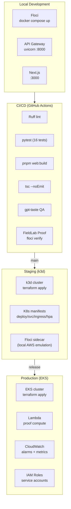

# Praxis Deployment Guide

The full path from local FieldLab development to production Kubernetes deployment.



## Prerequisites

| Tool | Version | Purpose |
|------|---------|---------|
| Docker | 24+ | Floci + container build |
| Python | 3.12+ | Backend services |
| Node.js | 22+ | Frontend |
| pnpm | 10.29.3+ | Package management |
| kubectl | 1.29+ | K8s management |
| terraform | 1.7+ | Infrastructure as code |

## 1. Local Development

```bash
# Full install
make install

# Start Floci
docker run -d --name floci \
  -p 4566:4566 \
  -v /var/run/docker.sock:/var/run/docker.sock \
  -u root \
  floci/floci:latest

# Verify Floci
python scripts/check_floci_runtime.py

# Start all services
make dev-api       # API Gateway :8000
make dev-web       # Next.js :3000

# Run FieldLab demo
make praxis-proof  # PROOF VALID
```

## 2. CI Pipeline

```bash
# Full validation suite
make lint                    # Ruff
.venv/bin/pytest tests/praxis -v   # 16 tests
pnpm web:typecheck           # TypeScript
pnpm web:lint:gpt-taste:ci   # Design quality
pnpm web:build               # Production build

# Floci-dependent gates (requires Floci running)
make praxis-floci-verify     # Floci health
make praxis-benchmark        # 3/3 proofs valid
make praxis-proof-hashes     # Hash integrity
```

## 3. Staging Deploy

```bash
# Create k3d cluster
k3d cluster create praxis-staging

# Deploy via Terraform
cd infrastructure/terraform
terraform init
terraform apply -var="environment=staging"

# Deploy K8s manifests
cd ../k8s
kubectl apply -f deployment.yaml
kubectl apply -f service.yaml
kubectl apply -f ingress.yaml
kubectl apply -f hpa.yaml
kubectl apply -f networkpolicy.yaml
kubectl apply -f poddisruptionbudget.yaml

# Verify
kubectl get all -n praxis-staging
curl https://staging.praxis.local/health
```

## 4. Production Deploy

```bash
# Create EKS cluster
cd infrastructure/terraform
terraform init
terraform apply -var="environment=production"

# Deploy Lambda
cd ../lambda
sam build && sam deploy --guided

# Deploy K8s
cd ../k8s
kubectl apply -f deployment.yaml
# ... (same as staging, minus Floci sidecar)

# Verify
kubectl get all -n praxis-production
curl https://api.praxis.io/health
```

## Environment Matrix

| Setting | Dev | Staging | Production |
|---------|-----|---------|------------|
| Floci endpoint | `localhost:4566` | `floci:4566` (sidecar) | AWS real endpoints |
| `USE_LAMBDA_COMPUTE` | `False` | `True` | `True` |
| `RATE_LIMIT_PER_MINUTE` | 600 | 600 | 120 |
| `ENV` | `development` | `staging` | `production` |
| `DEBUG` | `True` | `False` | `False` |
| Database | SQLite | SQLite | RDS PostgreSQL |

## Rollback

```bash
# Rollback K8s deployment
kubectl rollout undo deployment/api-gateway -n praxis-production

# Rollback Lambda
aws lambda update-alias \
  --function-name praxis-proof-compute \
  --name prod \
  --function-version <previous-version>
```
