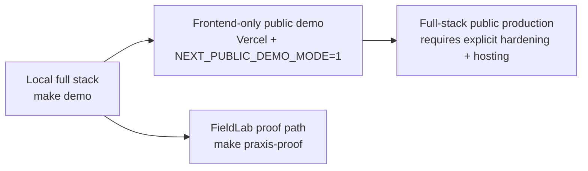

# Praxis Deployment Guide

This guide documents the release paths that are actually supported by the current repo.

It intentionally separates the verified demo deployment path from the harder full-stack production path so future sessions do not assume they are the same thing.

## Current Release Modes



## 1. Local Development

These are the repo-native commands for running Praxis on one machine.

```bash
make install
make demo
make demo-seed
make demo-validate
```

Service URLs:

- Web: `http://localhost:3000`
- API gateway: `http://localhost:8000`
- Decision service: `http://localhost:8001`
- Platform service: `http://localhost:8080`

To stop the local demo:

```bash
make clean-demo
```

## 2. Frontend-only Public Demo

This is the verified public launch path today.

Why it works:

- The Next.js app includes `app/api` proxy handlers
- In demo mode those handlers return deterministic fallback payloads
- The flagship product surfaces render without a separately deployed backend

### Required settings

Set this in the frontend deployment environment:

```bash
NEXT_PUBLIC_DEMO_MODE=1
```

### Deploy target

- Root deploy config: `vercel.json`
- App-level deploy config: `apps/web/vercel.json`

Both now describe a frontend-only Next.js deployment. The previous root `experimentalServices` block was removed so Vercel does not implicitly try to co-deploy `services/platform-service`.

### Recommended verification

```bash
pnpm web:typecheck
pnpm web:lint:gpt-taste:ci
pnpm web:test:smoke
pnpm web:build
```

## 3. Local Proof / FieldLab Verification

Use this when the task is to prove the flagship Praxis workflow rather than just render the UI.

```bash
make install
make praxis-fieldlab-up
make praxis-proof
make praxis-benchmark
make praxis-floci-verify
make praxis-fieldlab-down
```

Generated artifacts:

- `artifacts/latest/praxis_proof.json`
- `artifacts/latest/proof-summary.md`

## 4. Full-stack Public Production

This repo is not yet a turnkey one-command public production deploy.

What is present:

- A FastAPI gateway
- Local Docker Compose for the backend stack
- Kubernetes manifests under `infrastructure/k8s/`
- Terraform assets under `infrastructure/terraform/`
- Lambda reference assets under `infrastructure/lambda/`

What is not verified by repo CI today:

- A single public cloud deployment recipe for the full backend stack
- A hosted production environment exercised by automated end-to-end validation

### Required hardening before real public production

The API gateway now enforces these checks when `ENV=production`:

- `SECRET_KEY` must be replaced with a strong real secret
- `DEBUG` must be `false`
- `ALLOWED_ORIGINS` must list explicit non-localhost frontend origins

Additional required steps:

- Replace or rotate demo credentials stored in `users.json`
- Choose and validate a real backend hosting target
- Confirm public DNS, TLS, logging, and data retention decisions outside the demo path

See also: [Public Launch Checklist](../release/public-launch-checklist.md)

## Docker Compose Scope

`docker-compose.yml` is now explicitly a local development stack:

- `ENV=development`
- local default origins only
- local demo secret only

Do not treat it as a production deployment manifest.

## Done When

### Demo publish

- `NEXT_PUBLIC_DEMO_MODE=1` is set
- frontend verification commands pass
- the deployed site renders the flagship routes cleanly

### Public production publish

- production env vars are real and non-demo
- demo credentials are replaced
- the chosen backend hosting path is deployed and tested
- frontend and backend verification commands pass against that environment

## Known Unknowns

- The repo contains cloud-oriented assets, but this guide does not claim a verified EKS or Lambda release path because that path is not exercised by current GitHub Actions
- If you want a real production launch, the remaining work is mostly deployment and secrets management, not frontend polish
