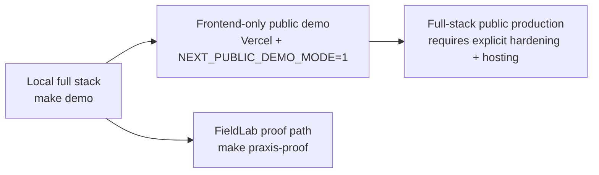

# Praxis Deployment Guide

This guide documents the release paths that are actually supported by the current repo.

It intentionally separates the verified demo deployment path from the harder full-stack production path so future sessions do not assume they are the same thing.

## Flagship Claim

Praxis is a flagship public demo and technical proof system, with a functional but not fully productized backend production path. The verified paths today are the frontend-only public demo (`NEXT_PUBLIC_DEMO_MODE=1`), the local FieldLab proof (`make praxis-proof`), and a green PR-run Docker Compose production proof recorded in `docs/verification/2026-05-19-docker-compose-production-proof.md`. The Docker Compose self-hosted backend path remains the recommended deployment target for real production use; post-merge `main` verification should still be observed separately.

## Current Release Modes



## 1. Local Development

These are the repo-native commands for running Praxis on one machine.

```bash
make install
make demo
make demo-seed
make demo-validate
```

Service URLs:

- Web: `http://localhost:3000`
- API gateway: `http://localhost:8000`
- Decision service: `http://localhost:8001`
- Platform service: `http://localhost:8080`

To stop the local demo:

```bash
make clean-demo
```

## 2. Frontend-only Public Demo

This is the verified public launch path today.

Why it works:

- The Next.js app includes `app/api` proxy handlers
- In demo mode those handlers return deterministic fallback payloads
- The flagship product surfaces render without a separately deployed backend

### Required settings

Set this in the frontend deployment environment:

```bash
NEXT_PUBLIC_DEMO_MODE=1
```

### Deploy target

- Root deploy config: `vercel.json`
- App-level deploy config: `apps/web/vercel.json`

Both now describe a frontend-only Next.js deployment. The previous root `experimentalServices` block was removed so Vercel does not implicitly try to co-deploy `services/platform-service`.

### Recommended verification

```bash
pnpm web:typecheck
pnpm web:lint:gpt-taste:ci
pnpm web:test:smoke
pnpm web:build
```

## 3. Local Proof / FieldLab Verification

Use this when the task is to prove the flagship Praxis workflow rather than just render the UI.

```bash
make install
make praxis-fieldlab-up
make praxis-proof
make praxis-benchmark
make praxis-floci-verify
make praxis-fieldlab-down
```

Generated artifacts:

- `artifacts/latest/praxis_proof.json`
- `artifacts/latest/proof-summary.md`

## 4. Full-stack Self-hosted / Cloud Production

The repo ships three concrete paths for running the full backend stack. **Docker Compose (Path A) is the recommended and most concrete path.** Fly.io and Railway are documented as secondary references but have not been exercised end-to-end by CI. Docker Compose now has a dedicated production-proof job in `.github/workflows/ci.yml`, with the first observed green PR run captured in `docs/verification/2026-05-19-docker-compose-production-proof.md`.

### Functional-enough production acceptance bar

Before claiming a backend-backed deployment works:

- [ ] Backend boots in production mode with real `SECRET_KEY`, `ENV=production`, `DEBUG=false`, and public `ALLOWED_ORIGINS`
- [ ] `/health` endpoint returns `{"status":"healthy"}`
- [ ] Frontend can reach the backend via `NEXT_PUBLIC_API_URL` without `NEXT_PUBLIC_DEMO_MODE`
- [ ] At least one real backend-backed workflow completes: login, core route load, and one proof/decision or solution-pack flow
- [ ] Known non-turnkey gaps are documented rather than hidden

### Environment variables required for every path

```bash
SECRET_KEY        # strong random secret — openssl rand -base64 32
ALLOWED_ORIGINS   # comma-separated public frontend URLs, e.g. https://praxis.example.com
POSTGRES_PASSWORD # strong database password
ENV=production
DEBUG=false
```

The API gateway enforces at boot: if `ENV=production` and `SECRET_KEY` is a placeholder, `DEBUG` is true, or `ALLOWED_ORIGINS` is localhost-only, the process exits immediately with a descriptive error.

---

### Path A — VPS / any server with Docker Compose (recommended)

This is the most concrete and least assumption-heavy backend path in the repo. It works on any machine that has Docker and Docker Compose v2 (DigitalOcean Droplet, Hetzner, EC2, Lightsail, etc.).

```bash
# 1. Clone and enter the repo
git clone https://github.com/AngelP17/praxis && cd praxis

# 2. Create .env from the template
cp .env.example .env
# Edit .env: set SECRET_KEY, POSTGRES_PASSWORD, ALLOWED_ORIGINS

# 3. Start the full stack in production mode
docker compose -f docker-compose.yml -f docker-compose.prod.yml up -d

# 4. Seed demo data (optional)
docker compose exec api-gateway python scripts/run_scenario.py --all --approve

# 5. Verify the gateway is healthy
curl http://localhost:8000/health
```

The `docker-compose.prod.yml` override sets `ENV=production`, removes dev port bindings for backend services, and passes secrets from your `.env`. Put Nginx or Caddy in front for TLS and routing.

**Stop / update:**
```bash
docker compose -f docker-compose.yml -f docker-compose.prod.yml down
git pull && docker compose -f docker-compose.yml -f docker-compose.prod.yml up -d --build
```

---

### Path B — Fly.io

Config: [`fly.toml`](../../fly.toml) (targets `apps/api_gateway/Dockerfile`).

```bash
# 1. Install flyctl and log in
brew install flyctl && fly auth login

# 2. Create the app (first time only)
fly apps create praxis-api

# 3. Provision a Postgres database
fly postgres create --name praxis-db
fly postgres attach --app praxis-api praxis-db
# ^ DATABASE_URL is set automatically as a secret

# 4. Set remaining secrets
fly secrets set \
  ENV=production \
  DEBUG=false \
  SECRET_KEY="$(openssl rand -base64 32)" \
  ALLOWED_ORIGINS="https://your-frontend.vercel.app"

# 5. Deploy
fly deploy

# 6. Verify
fly status
curl https://praxis-api.fly.dev/health
```

Set `NEXT_PUBLIC_API_URL=https://praxis-api.fly.dev` in your frontend deployment (Vercel env vars) and remove `NEXT_PUBLIC_DEMO_MODE`.

**Update:**
```bash
git pull && fly deploy
```

---

### Path C — Railway

Config: [`railway.toml`](../../railway.toml) (targets `apps/api_gateway/Dockerfile`).

```bash
# 1. Install the Railway CLI and log in
npm install -g @railway/cli && railway login

# 2. Create a new project
railway init

# 3. Add Postgres (Railway provisions it and sets DATABASE_URL)
railway add --database postgres

# 4. Set environment variables
railway variables set \
  ENV=production \
  DEBUG=false \
  SECRET_KEY="$(openssl rand -base64 32)" \
  ALLOWED_ORIGINS="https://your-frontend.vercel.app"

# 5. Deploy
railway up

# 6. Get the public URL and verify
railway domain
curl https://<your-railway-domain>/health
```

Set that Railway URL as `NEXT_PUBLIC_API_URL` in your frontend deployment and remove `NEXT_PUBLIC_DEMO_MODE`.

**Update:**
```bash
git push  # Railway auto-deploys from GitHub if connected, or: railway up
```

---

### Frontend wiring for Paths B and C

Once the backend is running publicly, update your Vercel project:

| Variable | Value |
|---|---|
| `NEXT_PUBLIC_API_URL` | Your backend public URL (no trailing slash) |
| `NEXT_PUBLIC_DEMO_MODE` | Remove entirely (or leave unset) |

Redeploy the frontend. The Next.js proxy routes will forward to the live backend instead of returning demo fallbacks.

---

### Before going live with real users

- Rotate `users.json` demo credentials — the defaults (`admin/admin`, `operator/operator`) are for local/demo only
- Confirm your `ALLOWED_ORIGINS` exactly matches the deployed frontend URL
- Review `infrastructure/k8s/` and `infrastructure/terraform/` if you need Kubernetes or IaC-managed infra instead

See also: [Public Launch Checklist](../release/public-launch-checklist.md)

## Docker Compose Scope

`docker-compose.yml` is the local development stack:
- `ENV=development`, local secrets, all ports exposed for direct access

`docker-compose.prod.yml` is the production override:
- Enables `ENV=production`, passes real secrets, attempts to remove dev port bindings
- Note: `ports: []` in the override may not fully clear base-file ports in all Docker Compose versions — restrict access at the host firewall level and use a reverse proxy for public routing

Do not use `docker-compose.yml` alone as a production manifest.

## Done When

### Demo publish (frontend-only)

- `NEXT_PUBLIC_DEMO_MODE=1` is set in your Vercel project
- `pnpm web:build` and `pnpm web:test:smoke` pass
- Deployed site renders all flagship routes

### Full-stack production publish

- Backend deployed via Path A, B, or C and `/health` returns `{"status":"healthy"}`
- `NEXT_PUBLIC_API_URL` points to the live backend
- `NEXT_PUBLIC_DEMO_MODE` is unset
- Demo credentials in `users.json` are replaced
