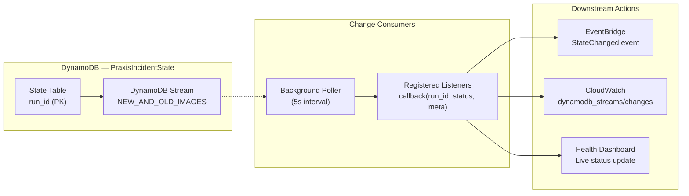

# DynamoDB Streams

Real-time change data capture on the `PraxisIncidentState` DynamoDB table. When a run's status or metadata changes, registered listeners are notified within seconds.



## Enabling Streams

```python
from fieldlab.floci_state_store import FlociStateStore

store = FlociStateStore()
result = store.enable_streaming()
# {"status": "enabled", "table": "PraxisIncidentState", "stream_arn": "arn:..."}
```

This calls `dynamodb.update_table()` with `StreamSpecification`:
- `StreamEnabled: true`
- `StreamViewType: NEW_AND_OLD_IMAGES`

## Subscribing to Changes

```python
def on_status_change(run_id: str, status: str, metadata: dict):
    print(f"Run {run_id} → {status}")

store.subscribe_to_changes(on_status_change)
store.start_stream_poller(interval=5.0)  # poll every 5s
```

The poller compares each item's current state against the last seen state and fires callbacks only on actual changes.

## Architecture Notes

- **In-process streaming**: Since Floci's DynamoDB Streams support is partial, the `FlociStateStore` implements a polling-based change detector that simulates stream behavior
- **Fallback**: When streams are unavailable, `_notify_listeners()` fires inline on every `update_run_status()` call
- **Background thread**: The poller runs as a daemon thread, does not block the main request loop
- **Performance**: 5-second polling interval balances freshness with DynamoDB read cost

## Metrics

| Metric | Purpose |
|--------|---------|
| `dynamodb_streams/enabled` | Count of times streaming was enabled |
| `dynamodb_streams/enable_failed` | Count of failed enable attempts |
