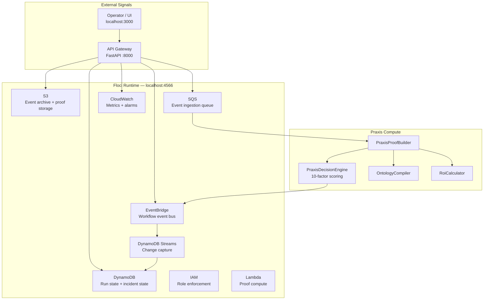

# FieldLab Runtime Architecture (Floci)

Floci provides a local AWS emulation layer that mirrors production infrastructure without requiring AWS credentials.



## Services Used

| Service | Port | Client | Primary Use |
|---------|------|--------|-------------|
| S3 | 4566 | `FlociEventSink` | Raw event archive, proof artifact storage |
| SQS | 4566 | `FlociEventSink` | Event ingestion, batch processing |
| DynamoDB | 4566 | `FlociStateStore` | Run state persistence, incident tracking |
| EventBridge | 4566 | `FlociWorkflowBus` | Workflow events (RunStarted, DecisionGenerated, ActionCaptured, ValueCaseReady) |
| CloudWatch | 4566 | `CloudWatchLogger` | Custom metrics, error tracking |
| Lambda | 4566 | `lambda_handler.py` | Serverless proof computation |
| IAM | 4566 | `IamRoleService` | Role-based access control |

## Quick Start

```bash
# Pull and run Floci
docker run -d --name floci \
  -p 4566:4566 \
  -v /var/run/docker.sock:/var/run/docker.sock \
  -u root \
  floci/floci:latest

# Verify health
python scripts/check_floci_runtime.py
```

## Health Check

The `/api/floci/health` endpoint returns live status:

```json
{
  "floci_available": true,
  "s3":    { "status": "healthy", "uptime": "2h 34m" },
  "sqs":   { "status": "healthy", "uptime": "2h 34m" },
  "dynamodb":   { "status": "healthy", "uptime": "2h 34m" },
  "eventbridge": { "status": "healthy", "uptime": "2h 34m" },
  "cloudwatch":  { "status": "healthy", "uptime": "2h 34m" }
}
```

## Resilience

When Floci is unavailable, the system degrades gracefully:

- `FieldLabService` caches Floci availability (30s TTL)
- Falls back to in-memory stores (`_MEMORY_STORE`, `_MEMORY_ACTIONS`)
- All CRUD operations continue via memory fallback
- Floci metrics/logging is silently skipped (no request blocking)
