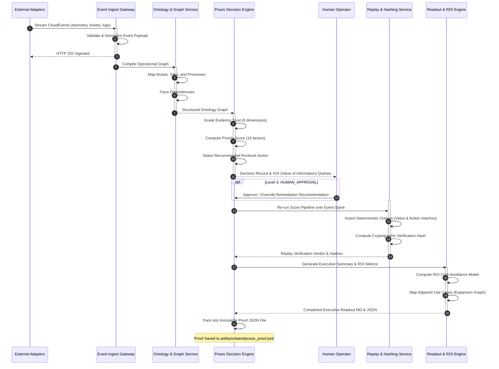

# Proof Lifecycle Architecture

This document describes the lifecycle of a **Proof-Carrying Praxis Artifact** from the initial ingestion of raw, noisy operational events to the final immutable cryptographic verification and executive readout.

## High-Level Lifecycle Flow

## Detailed Phase Breakdown

### Phase 1: Ingestion & Normalization
* **Inputs**: Messy events streamed via SQS or HTTP adapters mapping to the CloudEvents 1.0 schema.
* **Operations**: Key attributes are parsed into a normalized Python model `OperationalEvent` (`domain.events`). Unneeded metadata is stripped while retaining strict audit variables.

### Phase 2: Dependency Mapping (Ontology Compilation)
* **Operations**: The incoming incident triggers a graph compilation. The platform matches physical devices to software platforms and maps them to top-level business operations.
* **Output**: A graph describing which critical business operations are threatened by the anomaly.

### Phase 3: Astraea priority scoring & Recommendation
* **Operations**: The prioritized decision engine computes the severity vector. It grades evidence trust across 6 parameters (freshness, count, conflict, bias, completeness, precision).
* **Output**: An action policy suggestion and value-of-information (VOI) questions highlighting what missing data would improve the engine's confidence.

### Phase 4: Human-in-the-Loop Audit Gate
* **Operations**: For safety Level 3 recommendations, the action remains staged until an authorized user reviews and approves it. The approval decision triggers an outbox event.

### Phase 5: Replay & Cryptographic Proof Emission
* **Operations**: The event spine is replayed to ensure the scoring is reproducible. The system hashes the consolidated payload to produce the immutable signature (`proof_hash`).
* **Output**: `praxis_proof.json`.
