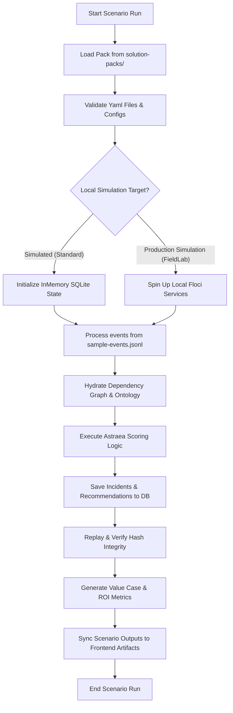

# Scenario Runtime Architecture

This document describes the runtime execution architecture of a **Praxis Scenario**. It defines how the system loads solution packs, initializes local simulation, pipes events, scores recommendations, and runs benchmarks.

## Runtime Flow Diagram

## Runtime Operations

### 1. Registry & Discovery
The repository uses a canonical scenario registry defined under `packages/domain/domain/scenarios.py`. Every consolidated flagship pack is registered with metadata including:
* Primary event schema
* Standard ROI formulations and economic impact coefficients
* Default incident priorities and recommended action cards

### 2. State Isolation
When a scenario runs via `make praxis-run-scenario SCENARIO=<name>` or `make praxis-run-all-scenarios`, it operates in a clean workspace:
* Real database changes write to `praxis.db` (for demo development) or isolated in-memory tables (for validation runs).
* In simulated runs, out-of-band dependencies (like AWS SQS/S3 APIs) are transparently routed through python mock utilities, maintaining zero-cost production fidelity without cloud credentials.

### 3. FieldLab Verification
When Docker Compose is up, running the scenario with `scripts/run_fieldlab_demo.py` leverages **Floci**, our local AWS-compatible simulation layer:
* SQS queues are dynamically provisioned.
* Simulated CloudEvents are emitted onto the queues.
* SQS pollers ingest the stream and feed the API gateway, checking end-to-end integration contracts under real transport constraints.

### 4. Scenario Benchmarking
To guarantee mathematical correctness and performance budgets, running `make praxis-scenario-benchmark` evaluates all registered scenarios across three metrics:
* **Scoring Speed**: Duration of priority scoring and ontology compilation (must be < 50ms).
* **Determinism**: Replaying the event spine must yield identical decision digests (100% match).
* **Hash Integrity**: Replay hashes must conform to the expected signatures in the expected-output directory.
