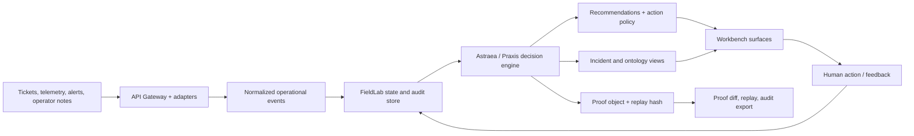
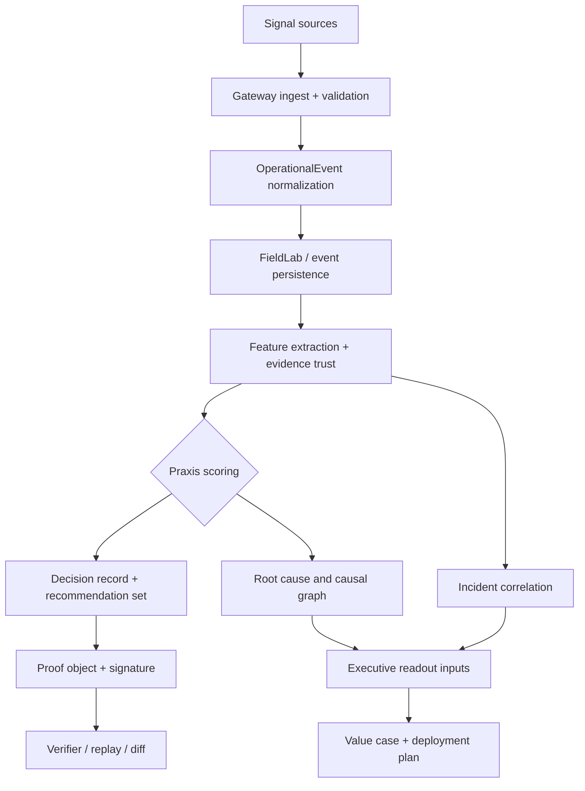
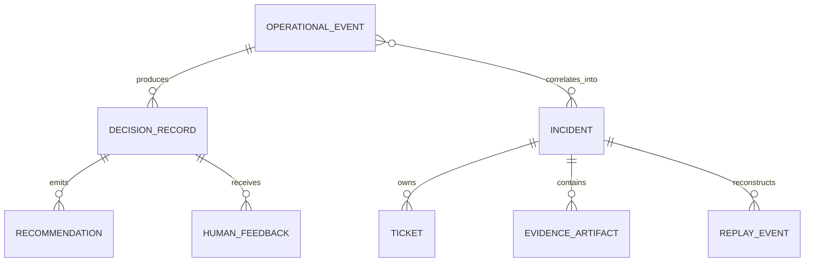

# System Overview

## Context

Praxis ingests operational signals, runs them through the FieldLab and decision stack, produces replayable proof-carrying recommendations, and presents cinematic workbench surfaces for operators, forward-deployed engineers, and GTM reviewers.

## Core Principles

1. **Event sourcing first** — every ticket change produces an immutable event
2. **Decision quality over dashboard fluff** — every feature must improve decision quality, speed, or trust
3. **Explainability by default** — every score and recommendation has a human-readable rationale
4. **Operator in the loop** — human feedback updates weights and improves future decisions

## Data Flow

## Database Architecture

## Key Design Decisions

- **FieldLab before production** — prove the workflow locally before any real hosted deployment
- **Deterministic decisioning** — identical inputs should produce identical scores, replays, and proof hashes
- **Rules-plus-graph reasoning** — operational logic stays inspectable and replayable
- **Human review by default** — the product recommends; humans approve or override
- **Immutable event trail** — operational events, proof artifacts, and feedback remain audit-friendly
