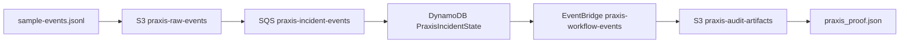

# FieldLab Floci Proof

Praxis FieldLab uses Floci (a local AWS emulator) to prove the full operational workflow without touching production infrastructure.

## What Floci Provides

| AWS Service | Local Endpoint | Purpose |
|-------------|---------------|---------|
| SQS | `http://localhost:4566` | Event ingestion queues |
| S3 | `http://localhost:4566` | Raw event archive + audit artifacts |
| DynamoDB | `http://localhost:4566` | Operational state + replay index |
| EventBridge | `http://localhost:4566` | Workflow event routing |

## Proof Path



## Commands

```bash
# Start FieldLab
make praxis-fieldlab-up

# Run proof-first demo
make praxis-proof

# Stop FieldLab
make praxis-fieldlab-down
```

## Verification

A valid proof must show:

1. Floci running on `:4566`
2. S3 buckets created
3. SQS queue created
4. DynamoDB state written
5. EventBridge event emitted
6. Proof generated with deterministic hash
7. Proof verified

## Current Status

FieldLab infrastructure is configured. The runtime path uses in-memory stubs for local development without requiring Docker. Full Floci runtime integration is available via the infrastructure files in `infrastructure/floci/`.