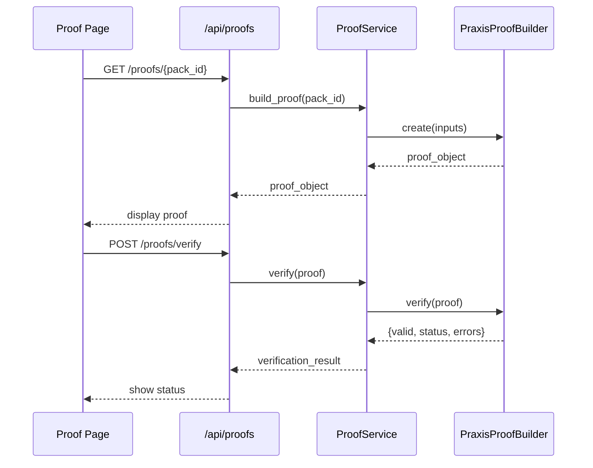

# Frontend Proof Wiring

The Praxis frontend connects to the proof API to display verifiable, deterministic proof objects.

## API Endpoints

| Method | Path | Purpose |
|--------|------|---------|
| GET | `/api/proofs/{pack_id}` | Fetch proof by solution pack |
| POST | `/api/proofs` | Create new proof from events |
| POST | `/api/proofs/verify` | Verify proof integrity |

## Components

### ProofObjectViewer

- Displays the full `praxis_proof.json` with syntax highlighting
- Shows deterministic hash values (no random placeholders)
- Copy-to-clipboard functionality
- Pack-specific data from `SOLUTION_PACKS` mock data

### DecisionProofCard

- Priority score with visual indicator
- Evidence trust breakdown
- Rationale weights
- Root cause hypothesis

### EvidenceTrustPanel

- 6-dimension trust scoring
- Source coverage visualization
- Corroboration and freshness scores

## Deterministic Hashes

Proof hashes are derived deterministically from pack data:

```typescript
const deterministicHash = (input: string): string => {
  let hash = 0;
  for (let i = 0; i < input.length; i++) {
    const char = input.charCodeAt(i);
    hash = ((hash << 5) - hash) + char;
    hash = hash & hash;
  }
  const hex = Math.abs(hash).toString(16).padStart(8, "0");
  return `sha256:${hex}${hex}${hex}${hex}`;
};
```

This ensures the same pack always produces the same proof hash, making the proof verifiable and replayable.

## Type Safety

```typescript
export interface ProofVerificationResponse {
  valid: boolean;
  status: string;
  errors: string[];
  proof_hash: string;
}
```

## Verification Flow

