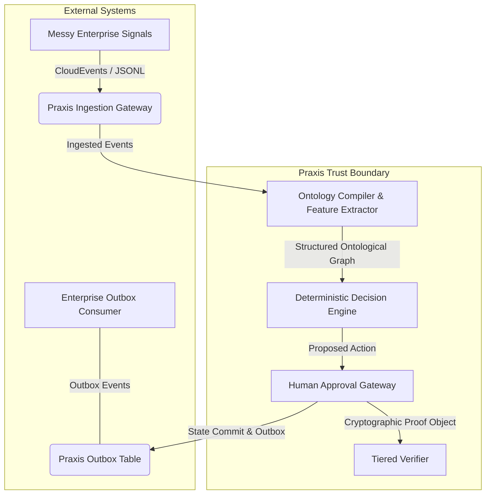
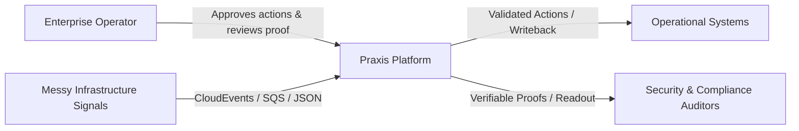
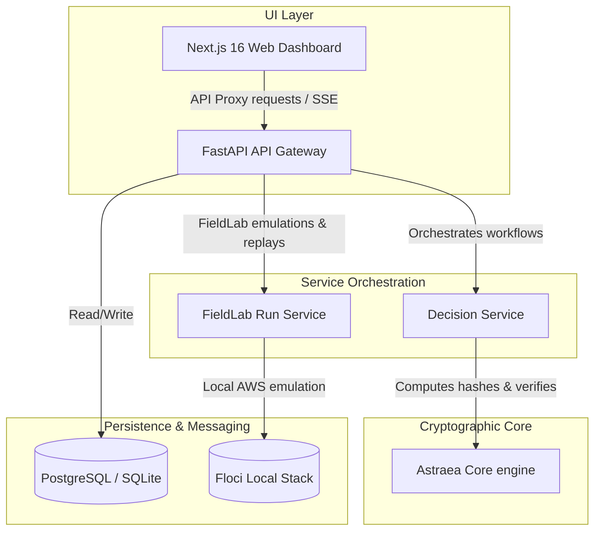
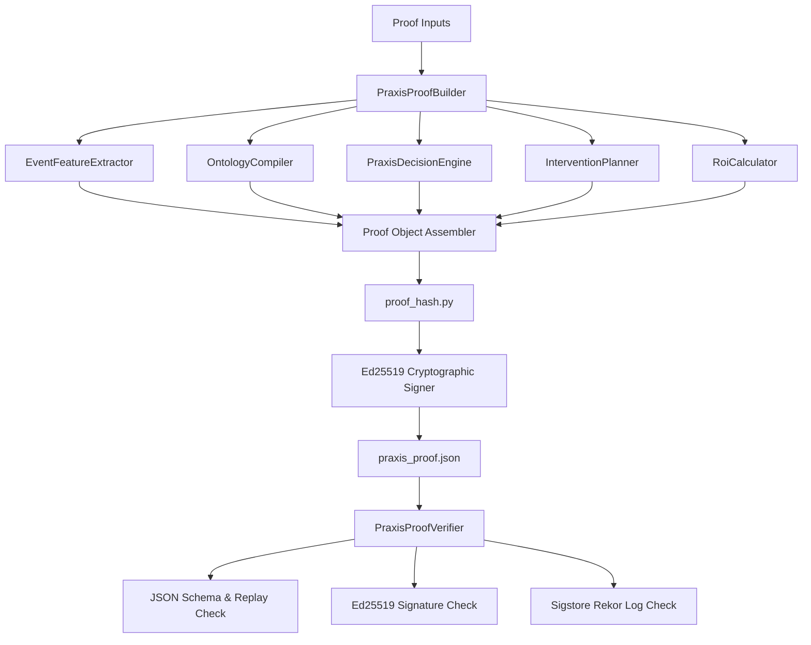

# Praxis Protocol and Platform Defense

This document serves as the authoritative architectural defense and verification specification for **Praxis**, a proof-carrying operational decision platform.

---

## 1. Problem
Modern enterprise AI systems fail in production because their decisions are inherently untraceable, irreproducible, and disconnected from human accountability or clear business value. When an automated or AI-assisted system triggers a high-impact operational action (such as shutting down a manufacturing pipeline or altering database replication topologies), it is typically impossible to answer the following questions with absolute certainty:
- What precise evidence was available to the engine at the moment the decision was made?
- Can we replay the exact logic to prove that the engine behaved predictably and was not subject to transient runtime drift or agentic hallucination?
- Was the final action approved by an authorized human operator, and can we cryptographically link that approval to the generated decision?
- What actual business value or risk reduction did this decision deliver, and how do we defend those calculations to stakeholders?

Currently, operational evidence is scattered across disparate logs, decision reasoning is opaque, human approval is tracked in separate ticketing tools, and value metrics are hand-calculated in separate spreadsheets. This lack of cryptographic provenance makes these systems highly vulnerable to tampering, untrusted audits, and operational failures.

---

## 2. Thesis
**Praxis** solves the enterprise AI trust gap by turning messy operational signals into **deterministic, replayable, human-governed decisions backed by a cryptographically verifiable proof-carrying protocol.**

By converting messy unstructured inputs into a structured operational ontology, scoring them via a deterministic rule-based prioritisation engine, enforcing human-in-the-loop sign-off, and producing a schema-validated proof object, Praxis ensures:
1. **Cryptographic Decisions**: Every decision carries a self-contained "proof object" containing all inputs, structured ontology states, scoring metadata, human actions, and value calculations.
2. **Deterministic Replayability**: Any auditor or independent system can recompute the decision hash and run-id from raw events, guaranteeing absolute reproducibility.
3. **Tamper-Resistance**: Any modification to the evidence, ontology, decision, action, or value case after production invalidates the canonical proof hash and signature.

---

## 3. System Boundary
To maintain absolute security and design clarity, the boundary of what Praxis does and does not do is strictly defined:

### What Praxis Does
- **Immutable Ingestion**: Collects unstructured/messy operational signals and converts them to structured CloudEvents.
- **Ontology Compiling**: Maps raw, messy data into structured operational objects, links, and actions.
- **Deterministic Priority Scoring**: Evaluates evidence trust, severity, recurrence risk, and process criticality to score priorities.
- **Human-Approved Action Governance**: Restricts external writebacks until an authorized operator explicitly approves the action.
- **Verification & Replay**: Verifies generated proof hashes, validates schema conformance, recomputes replay hashes, and verifies signatures.
- **Transactional Outbox**: Emits atomic events into a transactional database outbox to coordinate writeback actions with external systems safely.

### What Praxis Does NOT Do
- **Autonomous Writebacks**: Praxis does not perform direct writebacks to core operational systems without human-in-the-loop gating (or unless explicitly running in a sandboxed, low-risk, assisted mode).
- **Probabilistic Agent Execution**: Praxis rejects running LLM state machines directly in the critical decision-making loop. All AI layers are strictly frozen into deterministic ontologies and feature extractions at validation boundaries.
- **Identity Management**: Praxis delegates identity verification to standard enterprise OIDC providers, recording only the public key identity in proof signatures.

---

## 4. Architecture
The system follows a strict hierarchical C4-style architecture.

### System Context Diagram (L1)
Shows how Praxis interacts with operators, infrastructure signals, and enterprise targets.

### Container Diagram (L2)
Breaks down the platform into services, data stores, and interfaces.

### Component Diagram (L3)
Drills into the **Astraea Core** and its cryptographic pipeline components.

---

## 5. Protocol (Praxis Proof Protocol - PPP)
The Praxis Proof Protocol defines the structural and cryptographic constraints of the proof carrying decision.

### Proof Object Schema
Every generated proof must adhere to the JSON Schema Draft 2020-12 specification defined in [proof-object.schema.json](../../docs/spec/proof-object.schema.json). 

### Hash Exclusion Rules
To ensure that a signature or transparency log attestation validates the proof without modifying the thing being proven, the canonical `proof_hash` is computed on the **unsigned** payload.
The following fields are strictly excluded from the canonical hash computation:
- `proof_hash`
- `signature`
- `attestation`

This satisfies the mathematical invariant:
$$\text{proof\_hash}(\text{unsigned\_proof}) \equiv \text{proof\_hash}(\text{signed\_proof}) \equiv \text{proof\_hash}(\text{attested\_proof})$$

### Conformance Levels
Verification is tiered into three explicit levels:

| Level | Name | Scope & Verification Checks |
| :--- | :--- | :--- |
| **L0** | **Deterministic Proof** | - Validates against the JSON Schema. - Verifies presence of all required top-level elements. - Confirms `replay.deterministic` is `True`. - Recomputes the canonical `proof_hash` and asserts equality. |
| **L1** | **Signed Proof** | - Enforces all **L0** checks. - Requires a non-empty `signature` block. - Verifies the Ed25519 signature against the computed proof hash and the provided public key. |
| **L2** | **Attested Proof** | - Enforces all **L1** checks. - Requires a non-empty `attestation` block. - Verifies the Sigstore/Rekor transparency log bundle, validating inclusion proof and log index. Fails closed if the bundle is invalid or missing. |

---

## 6. Determinism Model
To guarantee that any auditor can replay a decision and obtain the exact same hash, the platform enforces strict determinism boundaries:

- **What is Deterministic**:
  - **Ontology Compilation**: Compiling same events leads to the identical node, link, and action count.
  - **Feature Extraction**: Event statistics, freshness scores, and corroboration metrics are purely algorithmic.
  - **Decision Scoring**: The 10-factor priority score and evidence trust score use pure arithmetic equations.
  - **ROI Calculations**: ROI and labor cost savings are derived from static configurations.
  - **Canonical Hashing**: The JSON serialization rules enforce key ordering and stable formatting.
- **Where Nondeterminism is Frozen**:
  - **Timestamps**: All creation timestamps (`verified_at`, `generated_at`) are captured once during execution and preserved as immutable fields in the proof. They are never regenerated during replay.
  - **System State**: The external customer context (e.g. system markdown) is captured as a static snapshot, hashed, and included in the proof object (`customer_context_hash`). Any change to the system context post-execution is instantly detected.

---

## 7. Threat Model
Praxis is designed to resist the following adversarial attack vectors:

### A1. Post-Decision Evidence Tampering (OWASP T1)
*   **Threat**: An attacker alters the raw events or ontology state in the database after a decision is made to justify a malicious action or hide negligence.
*   **Mitigation**: The verifier recomputes the canonical proof hash. Since the hash includes the raw event count, source coverage, and ontology link count, any alteration causes a `proof_hash mismatch` error.

### A2. Decision Hijacking / Priority Manipulation
*   **Threat**: A malicious operator modifies the decision priority score or confidence to bypass the human review threshold.
*   **Mitigation**: The decision parameters are part of the canonical proof hash. Modifying them causes immediate hash mismatch.

### A3. Human Action Forgery
*   **Threat**: An attacker changes the action status from `rejected` to `approved` to force the outbox publisher to execute a writeback action.
*   **Mitigation**: The `action` block is part of the signed proof. Under L1, signature verification fails if any field in the action block is altered.

### A4. Cryptographic Signature Forgery
*   **Threat**: An attacker signs a fake proof using a generated key pair, pretending to be an authorized operator.
*   **Mitigation**: The L1 verifier matches the `public_key_hex` against the database of authorized developer/operator certificates and keys.

### A5. Sigstore Attestation Tampering
*   **Threat**: An attacker copies an attestation block from a valid proof and appends it to a tampered proof.
*   **Mitigation**: The L2 verifier validates that the Rekor transparency log inclusion proof matches the unique signature and canonical hash of the current proof.

---

## 8. Verification Strategy
Verification is automated and enforced at multiple layers:
1.  **Local Test Suite**: Adversarial testing (`test_protocol_adversarial.py`) and schema conformance (`test_proof_schema_conformance.py`) run on every change.
2.  **Continuous Integration (CI)**: GitHub Actions run `pnpm typecheck`, `make lint`, `make test`, and `make praxis-validate-all` on every Pull Request.
3.  **Local SRE Emulation**: SRE validation scripts verify active Floci AWS environments to check ingestion integrity.
4.  **CLI Tooling**: The `verify_praxis_proof.py` script provides a portable binary/CLI path to verify proofs out of band in production or staging.

---

## 9. Production Model
For real-world deployment, Praxis adheres to strict production and security standards:

- **Deployment**: Blessed deploy target is Docker Compose (`docker-compose.yml` + `docker-compose.prod.yml`) utilizing Postgres for persistence and secure environment settings.
- **Secret Management**: Signing private keys are managed outside the application using AWS KMS or HashiCorp Vault. The gateway reads only the public key identifier (`signer_kid`).
- **Telemetry & Health**: Telemetry is collected using standard OpenTelemetry and Prometheus endpoints, monitoring API availability, proof verification success rate, and replay drift.

---

## 10. Limitations (Honest Disclosure)
- **Demo Sandbox Mode**: The public demo mode (`NEXT_PUBLIC_DEMO_MODE=1`) is entirely frontend-contained and runs with mock parameters to enable interactive UI reviews.
- **Docker Dependency for Verification**: Running full Floci SRE tests (`make praxis-validate-all`) requires a local Docker daemon. Without Docker, these SRE tests fail closed.
- **Sigstore Integration Status**: The L2 Sigstore transparency log inclusion check is experimental and operates in a fail-closed configuration unless a valid attestation bundle is generated.

---

## 11. Interview Demo Script
See the complete [7-Minute Interview Walkthrough Script](../demo/interview-demo-script.md) for a step-by-step technical demonstration walkthrough of the platform's core thesis.
