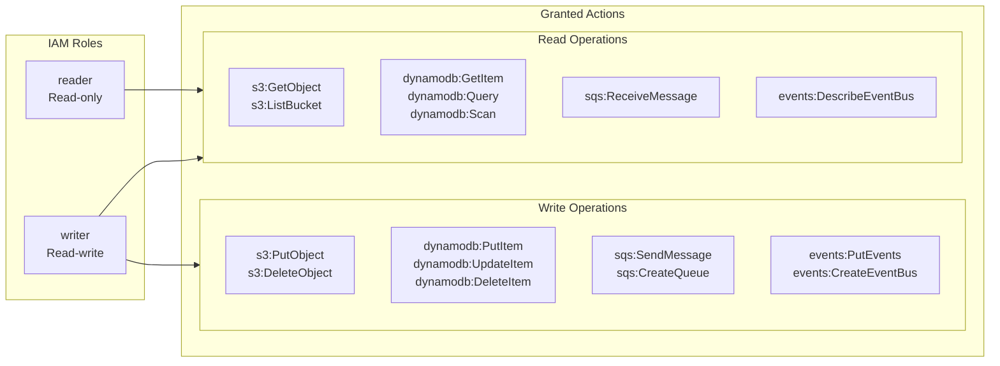

# IAM Roles for Praxis FieldLab

## Overview

Praxis uses AWS IAM roles to enforce least-privilege access across all FieldLab operations. The IAM layer gates every boto3 call through the `FlociClient`, ensuring that services can only perform actions their role permits.



## Policies

### Reader (`praxis-fieldlab-reader.json`)

The reader role permits only read-only operations. Use for audit viewing, proof verification, and readout generation.

| Service | Allowed Actions |
|---------|----------------|
| S3 | `GetObject`, `ListBucket` |
| DynamoDB | `GetItem`, `Query`, `Scan`, `DescribeTable` |
| SQS | `ReceiveMessage`, `GetQueueAttributes` |
| EventBridge | `DescribeEventBus` |

### Writer (`praxis-fieldlab-writer.json`)

The writer role adds mutation permissions. Use for run creation, event ingestion, action approval, and proof generation.

| Service | Allowed Actions (cumulative) |
|---------|------------------------------|
| S3 | +`PutObject`, `DeleteObject` |
| DynamoDB | +`PutItem`, `UpdateItem`, `DeleteItem`, `BatchWriteItem` |
| SQS | +`SendMessage`, `DeleteMessage`, `PurgeQueue`, `CreateQueue` |
| EventBridge | +`PutEvents`, `CreateEventBus` |

## Enforcement

The `FlociClient` wraps every AWS call with an IAM authorization check:

```python
from fieldlab.floci_client import FlociClient

# Writer client — full access
client = FlociClient(iam_role="writer")

# Reader client — read-only (Write operations raise PermissionError)
reader = client.switch_role("reader")

# Manual authorization
client.iam.authorize("dynamodb:PutItem")    # OK for writer, raises for reader
```

The `IamRoleService` in `floci_iam.py` loads the policy JSON at init time and provides `is_allowed(action)` and `authorize(action)` methods.

## Configuration

| Setting | Default | Purpose |
|---------|---------|---------|
| `iam_role` | `"writer"` | Default role for FlociClient |
| Policy path | `infrastructure/iam/` | Directory containing policy JSON files |

## Testing

```bash
# Verify reader cannot write
python -c "
from fieldlab.floci_client import FlociClient
reader = FlociClient(iam_role='reader')
try:
    reader.iam.authorize('dynamodb:PutItem')
except PermissionError as e:
    print(f'Blocked: {e}')
"
```
