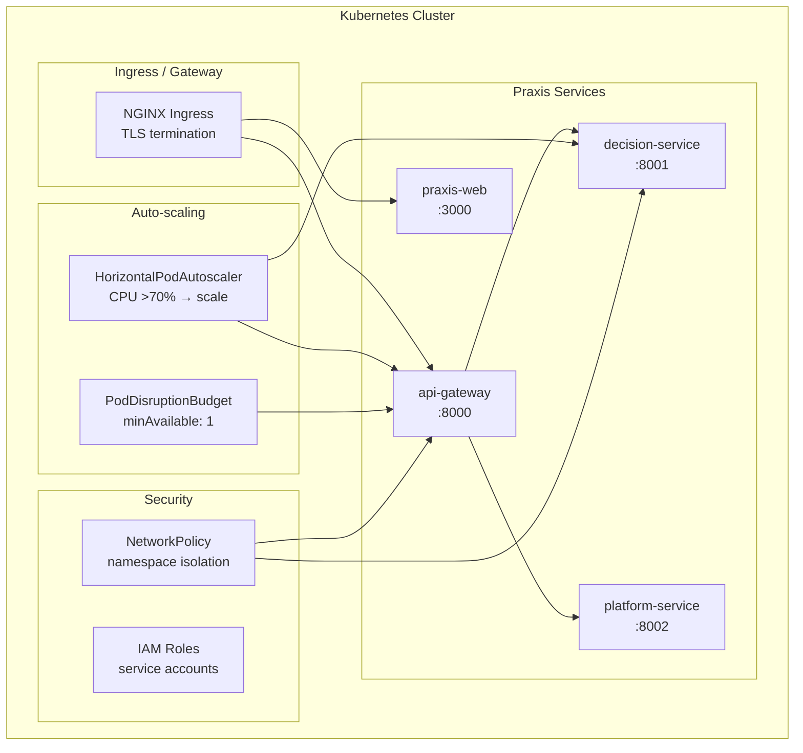

# Kubernetes Deployment

Production-grade orchestration manifests for Praxis on k3d (local) or EKS (cloud).



## Manifests

| File | Purpose |
|------|---------|
| `deployment.yaml` | API Gateway + Decision Service deployments |
| `service.yaml` | ClusterIP services for internal routing |
| `ingress.yaml` | NGINX ingress with TLS + path routing |
| `hpa.yaml` | Horizontal Pod Autoscaler (CPU target: 70%) |
| `networkpolicy.yaml` | Namespace isolation, allow-listed ingress |
| `poddisruptionbudget.yaml` | Min 1 pod available during voluntary disruptions |

## Deploy to k3d

```bash
# Create cluster
k3d cluster create praxis --servers 1 --agents 2

# Apply Terraform (or kubectl directly)
cd infrastructure/k8s
kubectl apply -f deployment.yaml
kubectl apply -f service.yaml
kubectl apply -f ingress.yaml
kubectl apply -f hpa.yaml
kubectl apply -f networkpolicy.yaml
kubectl apply -f poddisruptionbudget.yaml

# Verify
kubectl get pods -n praxis
kubectl get svc -n praxis
```

## Deploy to EKS

```bash
# Create EKS cluster via terraform
cd infrastructure/terraform
terraform init
terraform apply

# Deploy manifests
aws eks update-kubeconfig --region us-east-1 --name praxis-prod
kubectl apply -f ../k8s/
```

## Scaling

| Trigger | Action |
|---------|--------|
| CPU > 70% | Add 1 pod (max 10) |
| Memory > 80% | Add 1 pod |
| Error rate > 10% | Manual investigation |

## Network Policy

Default-deny with explicit allow-lists:
- API Gateway → Decision Service (port 8001)
- API Gateway → Platform Service (port 8002)
- Web → API Gateway (port 8000)
- All → Floci (port 4566, local only)
