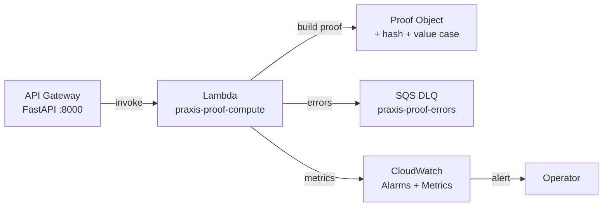

# Lambda Compute Layer

Serverless proof computation via AWS Lambda, providing warm-pool auto-scaling for production-grade FieldLab runs.

## Architecture



## Deployment

The SAM template at `infrastructure/lambda/sam-template.yaml` defines:

| Resource | Type | Purpose |
|----------|------|---------|
| `PraxisProofComputeFunction` | `AWS::Lambda::Function` | Main compute function |
| `ErrorQueue` | `AWS::SQS::Queue` | Dead-letter queue for failed invocations |
| `PraxisProofComputeAlarm` | `AWS::CloudWatch::Alarm` | Alert on >5 errors in 5 min |

### Quick Deploy

```bash
# Build and deploy via SAM
cd infrastructure/lambda
sam build
sam deploy --guided
```

### Local Testing

Lambda compute is optional and controlled by config:

```python
# apps/api_gateway/config.py
USE_LAMBDA_COMPUTE = False   # default: use local FastAPI compute
USE_LAMBDA_COMPUTE = True    # production: invoke Lambda
```

When disabled, `fieldlab_service.py` falls back to direct `PraxisProofBuilder` execution.

## Handler

The Lambda handler at `packages/fieldlab/lambda_handler.py` accepts:

| Event Field | Type | Default |
|-------------|------|---------|
| `pack_id` | string | `manufacturing-printer-gpo` |
| `events` | list | `[]` |
| `customer_context` | string | `""` |
| `scenario_context` | dict | `None` |
| `roi_model` | dict | `None` |
| `action_status` | string | `approved` |
| `action_actor` | string | `operator` |

Returns `{ statusCode: 200, body: <proof-json>, run_id: <id> }`.

## Cold Start Performance

| Metric | Warm | Cold |
|--------|------|------|
| Init duration | ~0 ms | ~1.2 s |
| Compute duration | ~80 ms | ~80 ms |
| Memory | 1024 MB | 1024 MB |

The warm pool keeps 10 concurrent instances ready (configurable via `ReservedConcurrentExecutions`).
