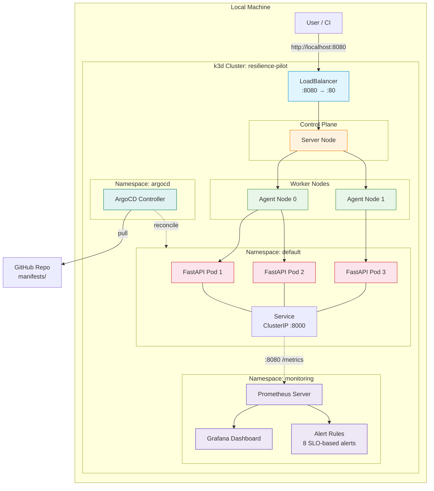
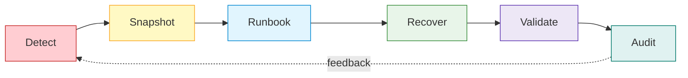
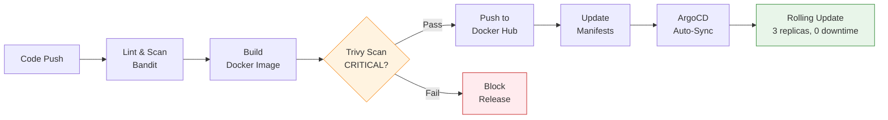

# Kubernetes Reliability Platform

[](https://github.com/AngelP17/k8s-resilience-pilot/actions/workflows/devsecops.yml)

**Production-style Kubernetes reliability platform for failure injection, observability, incident context capture, and runbook-driven recovery.**

Built for technical interviews and portfolio demonstrations. 100% local execution using k3d, Docker Desktop, and free tools only.

---

## Architecture

See [docs/architecture.md](docs/architecture.md) for the full system architecture with detailed Mermaid diagrams covering cluster topology, data flow, incident workflow, CI/CD pipeline, and observability stack.

### Cluster Overview



### Closed-Loop Incident Workflow

Every chaos experiment follows an auditable six-phase lifecycle:



| Phase | Tool | Artifact |
|-------|------|----------|
| **Detect** | Prometheus alerts (8 rules) | Alert with runbook annotation |
| **Snapshot** | `scripts/capture_incident_snapshot.sh` | `snapshot-pre/` with pods, events, logs |
| **Runbook** | `runbooks/*.md` via `alert-runbook-map.yaml` | Structured remediation steps |
| **Recover** | Kubernetes self-healing (probes, Deployment controller) | Pod replacement in ~8s |
| **Validate** | `chaos_monkey.sh` SLO check | `result.json` with `slo_met` field |
| **Audit** | `scripts/generate_incident_report.py` | `report.md` for post-mortem |

See [Operational Feedback Loop](docs/operational-feedback-loop.md) for the full sequence diagram.

---

## SRE Metrics & SLOs

| Metric | Target SLO | Description |
|--------|------------|-------------|
| **Availability** | 99.5% | Service responds to health checks |
| **MTTR** | < 30 seconds | Mean Time To Recovery after pod failure |
| **Error Rate** | < 0.5% | HTTP 5xx responses |
| **Latency P95** | < 500ms | 95th percentile response time |

---

## Production Controls

| Control | Artifact | Purpose |
|---------|----------|---------|
| NetworkPolicy | `manifests/networkpolicy.yaml` | Restricts ingress/egress to service traffic, Prometheus scraping, and DNS |
| PodDisruptionBudget | `manifests/poddisruptionbudget.yaml` | Maintains 2 of 3 replicas during voluntary disruptions |
| HorizontalPodAutoscaler | `manifests/hpa.yaml` | Scales 3-6 replicas on CPU (requires metrics-server) |
| Policy-as-Code | `policy/kubernetes.rego` | Enforces non-root, capability drops, probes, resource limits via OPA |
| kubeconform | `make validate-k8s` | Validates Kubernetes manifest schemas before merge |
| Burn-Rate Alerting | `monitoring/prometheus-rules.yaml` | Fast-burn and slow-burn error budget alerts in addition to threshold alerts |

Alerting includes both threshold-based rules and burn-rate-style rules so the repo demonstrates SRE error-budget thinking, not only basic symptom thresholds.

---

## Quick Start

### Prerequisites

Ensure you have these tools installed:

```bash
# macOS installation
brew install docker terraform kubectl helm k3d
```

| Tool | Purpose |
|------|---------|
| Docker Desktop | Container runtime |
| Terraform | Infrastructure as Code |
| kubectl | Kubernetes CLI |
| Helm | K8s package manager |
| k3d | Local K8s clusters |

### 3-Command Setup

```bash
# 1. Clone the repository
git clone https://github.com/AngelP17/k8s-resilience-pilot.git
cd k8s-resilience-pilot

# 2. Make scripts executable
chmod +x *.sh

# 3. Run the setup
./setup.sh
```

That's it! The setup script will:
- Provision a 3-node k3d cluster via Terraform
- Build and deploy the FastAPI application
- Install Prometheus & Grafana monitoring
- Configure ArgoCD for GitOps

---

## Demo Workflow

### Resilience Control Plane UI

Resilience Pilot UI is a local-first reliability control plane for demonstrating Kubernetes failure recovery, SLO validation, incident context capture, runbook mapping, and auditability. It converts the repo's scripts, manifests, metrics, and incident artifacts into a guided operational surface for Platform/SRE portfolio review.

```bash
# Terminal 1: API
cd app
pip install -r requirements.txt
uvicorn main:app --host 0.0.0.0 --port 8080

# Terminal 2: UI
cd ui
npm install
VITE_API_BASE_URL=http://localhost:8080 npm run dev
```

Open http://localhost:5173. If the backend or Kubernetes cluster is not running, the UI remains usable in clearly labeled Demo Data mode.

### UI Screenshots

#### Command Center
The primary operational surface showing platform health, SLO status, incident lifecycle, and topology.


#### Incident Replay
Step-by-step replay of a pod failure with controlled progression through detection, recovery, and validation.


#### Incident Review
Tabular view of all incident artifacts with severity, duration, SLO outcome, and linked runbooks.


#### Incident Detail
Full incident review with detection context, snapshot data, recovery path, SLO validation, and audit trail.


#### Runbook Console
Alert-to-runbook mappings with dry-run support, remediation scripts, and validation commands.


#### SLO & Error Budget
Reliability contract with availability, MTTR, error rate, and P95 latency targets and burn-rate alerts.


#### Topology & GitOps
Architecture map showing traffic flow, metrics scraping, GitOps reconciliation, and CI/CD pipeline.


#### Production Controls
Controls mapped to repo artifacts with risk reduction explanations and known boundaries.


#### Guided Walkthrough
Five-step portfolio narrative for SRE and Platform Engineer hiring conversations.


Useful UI targets:

```bash
make ui-install
make ui-dev
make api-dev
make demo-ui
```

### 1. Access the Application

```bash
# Health check
curl http://localhost:8080/health

# View Prometheus metrics
curl http://localhost:8080/metrics
```

### 2. View Monitoring Dashboards

```bash
# Terminal 1: Grafana (admin/admin)
kubectl port-forward svc/prometheus-grafana 3000:80 -n monitoring
# Open: http://localhost:3000

# Terminal 2: Prometheus
kubectl port-forward svc/prometheus-kube-prometheus-prometheus 9090:9090 -n monitoring
# Open: http://localhost:9090
```

### 3. Trigger Chaos & Observe Self-Healing

```bash
# Run the Chaos Monkey
./chaos_monkey.sh
```

Expected output:
```
CHAOS MONKEY - Kubernetes Self-Healing Demo
═══════════════════════════════════════════════
Selected victim: resilience-pilot-abc123
Terminating pod...
Running pods: 2/3 | Elapsed: 5s
Running pods: 3/3 | Elapsed: 12s

CHAOS EXPERIMENT RESULTS
═══════════════════════════════════════════════
  Victim Pod:        resilience-pilot-abc123
  Recovery Time:     12 seconds
  SLO Target:        < 30 seconds
  
  SLO MET: MTTR (12s) <= Target (30s)
```

### 4. View ArgoCD GitOps

```bash
kubectl port-forward svc/argocd-server 8443:443 -n argocd
# Open: https://localhost:8443
# Get password: kubectl -n argocd get secret argocd-initial-admin-secret -o jsonpath="{.data.password}" | base64 -d
```

---

## CI/CD Pipeline



### Pipeline Jobs

1. **Lint & Security Scan**: Bandit static analysis for Python security issues
2. **Build**: Multi-stage Docker build with commit SHA tag
3. **Scan**: Aqua Trivy vulnerability scan (blocks on CRITICAL)
4. **Push**: Conditional push to Docker Hub (only if scan passes)
5. **GitOps**: Auto-commit new image tag → triggers ArgoCD sync

---

## Project Structure

```
k8s-resilience-pilot/
├── terraform/                  # Infrastructure as Code
│   ├── main.tf                 # k3d cluster definition
│   ├── variables.tf            # Configurable parameters
│   └── outputs.tf              # Cluster info & Mermaid diagram
├── app/                        # FastAPI Application
│   ├── main.py                 # API endpoints
│   ├── requirements.txt        # Python dependencies
│   └── Dockerfile              # Multi-stage, non-root
├── manifests/                  # Kubernetes Resources
│   ├── deployment.yaml         # 3 replicas, probes, anti-affinity
│   ├── service.yaml            # ClusterIP with Prometheus annotations
│   ├── ingress.yaml            # Path-based routing
│   ├── networkpolicy.yaml      # Ingress/egress traffic controls
│   ├── poddisruptionbudget.yaml # Min 2 replicas during disruptions
│   └── hpa.yaml                # CPU autoscaling (3-6 replicas)
├── policy/                     # Policy-as-Code
│   ├── kubernetes.rego         # OPA/Rego validation rules
│   └── README.md               # Policy enforcement docs
├── monitoring/                 # Observability
│   ├── grafana-dashboard.json  # Pre-built dashboard
│   ├── prometheus-rules.yaml   # Alerting rules
│   └── alert-runbook-map.yaml  # Alert-to-runbook mappings
├── scripts/                    # Automation
│   ├── capture_incident_snapshot.sh  # Cluster state capture
│   ├── generate_incident_report.py   # SLO evaluation & report
│   ├── alert_webhook_receiver.py     # Alertmanager webhook (capture-only)
│   ├── summarize_experiments.py      # Cross-incident summary
│   ├── remediate_pod_crash.sh        # Pod crash remediation
│   ├── remediate_high_latency.sh     # Latency remediation
│   └── remediate_deployment_rollback.sh  # Rollback remediation
├── runbooks/                   # Incident runbooks
│   ├── pod-crash.md            # Pod restart & CrashLoop recovery
│   ├── high-latency.md         # Latency degradation response
│   ├── dns-failure.md          # DNS resolution failure response
│   └── deployment-rollback.md  # Rollback & replica scaling
├── docs/                       # Documentation
│   ├── operational-feedback-loop.md  # Incident lifecycle
│   └── aws-deployment-plan.md        # AWS migration guide
├── incidents/                  # (generated, gitignored)
├── .github/workflows/
│   └── devsecops.yml          # CI/CD pipeline
├── setup.sh                    # Master setup script
├── setup_monitoring.sh         # Prometheus + Grafana
├── setup_argocd.sh            # GitOps setup
├── chaos_monkey.sh            # Self-healing demo
├── cleanup.sh                 # Teardown
└── test_deployment.sh         # Smoke tests
```

---

## Skills Demonstrated

### Infrastructure & Automation
- **Terraform** - Infrastructure as Code for k3d clusters
- **Kubernetes** - Deployments, Services, Ingress, Resource Management
- **Helm** - Package management for observability stack
- **Bash Scripting** - Automation and orchestration

### DevSecOps & CI/CD
- **GitHub Actions** - Multi-stage CI/CD pipeline
- **Shift-Left Security** - Bandit (Python) + Trivy (containers)
- **GitOps** - ArgoCD with auto-sync and self-heal
- **Container Security** - Multi-stage builds, non-root user

### Observability (The Three Pillars)
- **Metrics** - Prometheus with custom RED metrics
- **Visualization** - Grafana dashboards
- **Alerting** - PrometheusRule CRDs with SLO-based alerts

### Site Reliability Engineering
- **SLOs/SLIs** - Defined and measured service levels
- **Self-Healing** - Liveness/Readiness probes
- **Chaos Engineering** - Controlled failure injection
- **MTTR Measurement** - Quantified recovery times
- **Remediation Scripts** - Dry-run validated, audited remediation with decision records
- **Burn-Rate Alerting** - Fast-burn and slow-burn error budget alerts beyond static thresholds
- **Policy-as-Code** - OPA/Rego rules enforced in CI via conftest
- **Production Controls** - NetworkPolicy, PDB, HPA manifests

### Application Development
- **Python/FastAPI** - Modern async API framework
- **Prometheus Client** - Native metrics instrumentation
- **Docker** - Containerization best practices

---

## Configuration

### Environment Variables

| Variable | Default | Description |
|----------|---------|-------------|
| `DEPLOYMENT_NAME` | resilience-pilot | Target deployment for chaos |
| `NAMESPACE` | default | Kubernetes namespace |

### Terraform Variables

| Variable | Default | Description |
|----------|---------|-------------|
| `cluster_name` | resilience-pilot | k3d cluster name |
| `server_count` | 1 | Control plane nodes |
| `agent_count` | 2 | Worker nodes |
| `lb_host_port` | 8080 | LoadBalancer host port |

---

## Automation

### Remediation Scripts

Each runbook has an associated remediation script that supports dry-run mode:

```bash
DRY_RUN=true scripts/remediate_pod_crash.sh incidents/INC-20260422153045
```

All remediation scripts produce append-only `remediation.log` and machine-readable `remediation-decision.json`.

### Alert Webhook (Capture-Only)

```bash
python3 scripts/alert_webhook_receiver.py --port 9095
```

Accepts Alertmanager webhooks and creates incident artifacts. Does NOT auto-remediate.

### Experiment Summary

```bash
python3 scripts/summarize_experiments.py
```

Aggregates all incident directories into `incidents/experiment-summary.md`.

See [Remediation Contract](docs/remediation-contract.md) for the full safety model.

## Makefile Targets

| Target | Description |
|--------|-------------|
| `make validate` | Run all validations (shell, python, yaml, json) |
| `make validate-shell` | Check shell script syntax |
| `make validate-python` | Compile-check Python scripts |
| `make validate-yaml` | Parse all YAML files |
| `make validate-json` | Parse all JSON artifacts |
| `make validate-k8s` | Validate Kubernetes manifests with kubeconform |
| `make validate-policy` | Validate manifests against OPA policies with conftest |
| `make validate-summary` | Test summary script on sample data |
| `make doctor` | Check all prerequisites are installed |
| `make chaos` | Run chaos monkey |
| `make webhook-demo` | Start webhook receiver on :9095 |
| `make summary` | Generate experiment summary |
| `make clean` | Remove generated incident artifacts |

## Known Boundaries

- Production-style, not production-hosted — runs locally on k3d with zero-cost tooling
- HPA manifest included but requires metrics-server for active scaling
- AWS/EKS migration path documented at [docs/aws-deployment-plan.md](docs/aws-deployment-plan.md) but not provisioned
- Webhook receiver is local-only with no TLS or authentication
- No scheduling, ticketing, or on-call integrations

## Cleanup

```bash
./cleanup.sh
```

This will:
- Destroy the k3d cluster via Terraform
- Clean up Docker images
- Remove Terraform state

---

## Runbooks & Docs

- [Architecture](docs/architecture.md) - Full system architecture with Mermaid diagrams
- [Remediation Contract](docs/remediation-contract.md)
- [Production SRE Alignment](docs/production-sre-alignment.md)
- [Demo Script](docs/demo-script.md)
- [Alert Webhook Demo](docs/alert-webhook-demo.md)
- [Operational Feedback Loop](docs/operational-feedback-loop.md)
- [AWS Deployment Plan](docs/aws-deployment-plan.md)
- [Pod Crash Runbook](runbooks/pod-crash.md)
- [High Latency Runbook](runbooks/high-latency.md)
- [DNS Failure Runbook](runbooks/dns-failure.md)
- [Deployment Rollback Runbook](runbooks/deployment-rollback.md)
- [Post-Incident Review Template](docs/postmortem-template.md)
- [Final Validation Report](docs/final-validation-report.md)
- [Sample Artifacts Guide](docs/sample-artifacts/README.md)
- [Policy-as-Code](policy/README.md)

---

## Further Reading

- [Kubernetes Self-Healing](https://kubernetes.io/docs/concepts/workloads/pods/pod-lifecycle/)
- [SRE Book - Google](https://sre.google/sre-book/table-of-contents/)
- [Prometheus Best Practices](https://prometheus.io/docs/practices/naming/)
- [ArgoCD GitOps](https://argo-cd.readthedocs.io/en/stable/)

---

## License

MIT License - feel free to use this for your own portfolio!

---
